# oracle-dk-k8s-adv-30thmay2022

## plan 

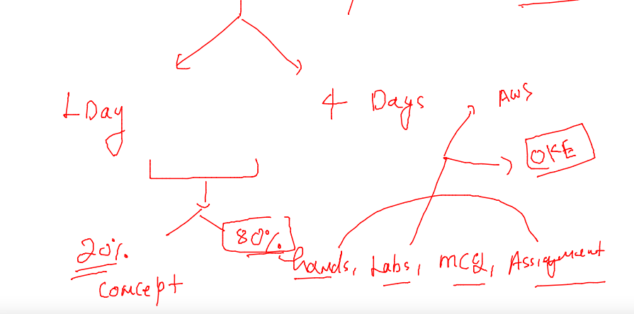

## Revision 

### docker operations using webUI 

```
docker  run -itd --name webui -p 9000:9000 -v /var/run/docker.sock:/var/run/docker.sock           --restart always   portainer/portainer 
Unable to find image 'portainer/portainer:latest' locally
latest: Pulling from portainer/portainer
772227786281: Pull complete 
96fd13befc87: Pull complete 
8b2d9b141e4d: Pull complete 
Digest: sha256:25415d1143949e5dc0b03585365dc8bbe84f443ef116dc27719dc69f23ead35e
Status: Downloaded newer image for portainer/portainer:latest
2d1ad677bcb6d6b30c69d2c4105e1159a28fb79f84b059fc00b6b27f6cf6fb04
[ashu@docker-host ~]$ docker  ps
CONTAINER ID   IMAGE                 COMMAND        CREATED         STATUS         PORTS                                       NAMES
2d1ad677bcb6   portainer/portainer   "/portainer"   4 seconds ago   Up 2 seconds   0.0.0.0:9000->9000/tcp, :::9000->9000/tcp   webui
[ashu@docker-host ~]$ 

```

## Explore more Dockerfile Examples 

### Example -- COPY vs  ADD 

### Dockerfile 

```
FROM oraclelinux:8.4  
LABEL name=ashutoshh
LABEL email=ashutoshh@linux.com
# to share image designer info with image users 
RUN yum install python3 -y && mkdir  /pycode
#  run is giving shell access during image build time
COPY  ashu.py  /pycode/ashu.py 
# will copy data from docker client to docker server during image build time
#  COPY src  Dest
# src must be w.r.t Dockerfile

WORKDIR /pycode 
# to change directory of dockerfile persistently 
# its like cd commad unix  / linux
RUN chmod +x ashu.py 
CMD  ["python3","ashu.py"]
# CMD means default process setting for docker image 
```

### build 

```
 docker  build  -t  ashupython:v1  . 
Sending build context to Docker daemon  3.584kB
Step 1/8 : FROM oraclelinux:8.4
8.4: Pulling from library/oraclelinux
a4df6f21af84: Pull complete 
Digest: sha256:b81d5b0638bb67030b207d28586d0e714a811cc612396dbe3410db406998b3ad
Status: Downloaded newer image for oraclelinux:8.4
 ---> 97e22ab49eea
Step 2/8 : LABEL name=ashutoshh
 ---> Running in 0bbe8c35f853
Removing intermediate container 0bbe8c35f853
 ---> 0f1cfd9d9a3c
Step 3/8 : LABEL email=ashutoshh@linux.com
 ---> Running in 06940bbb2011
Removing intermediate container 06940bbb2011
 ---> 2302a3b2835e

```
### creating container 

```
docker  run -itd  --name ashuc1  ashupython:v1 
2c87d730af56c8eac17b957ccacc0f8f4fc0987b2bf117d53f92077c4ed20f8b
[ashu@docker-host python_images]$ docker  ps
CONTAINER ID   IMAGE           COMMAND             CREATED         STATUS         PORTS     NAMES
2c87d730af56   ashupython:v1   "python3 ashu.py"   5 seconds ago   Up 4 seconds             ashuc1
```

### Entrypoint based Dockerfile 

```
FROM oraclelinux:8.4  
LABEL name=ashutoshh
LABEL email=ashutoshh@linux.com
# to share image designer info with image users 
RUN yum install python3 -y && mkdir  /pycode
#  run is giving shell access during image build time
COPY  ashu.py  /pycode/ashu.py 
# will copy data from docker client to docker server during image build time
#  COPY src  Dest
# src must be w.r.t Dockerfile

WORKDIR /pycode 
# to change directory of dockerfile persistently 
# its like cd commad unix  / linux
RUN chmod +x ashu.py 
#CMD  ["python3","ashu.py"]
ENTRYPOINT  python3  ashu.py
# entrypoint same as CMD with no replace option in the last argument of docker run 
# CMD means default process setting for docker image 

```

### COntainer orchestration engines /tools 

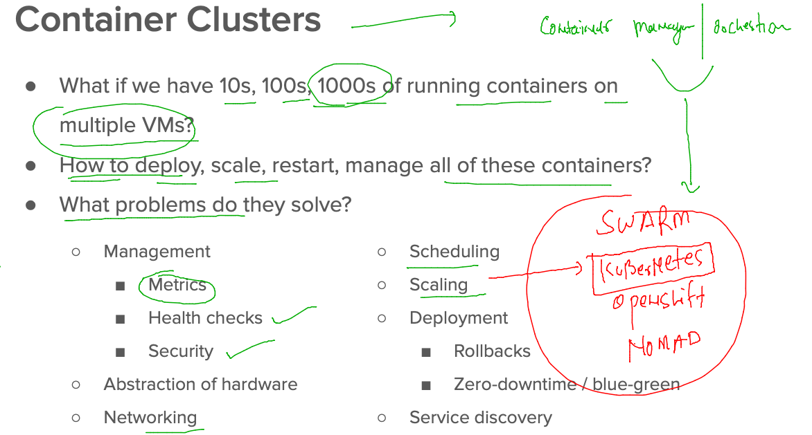

### k8s Introduction 

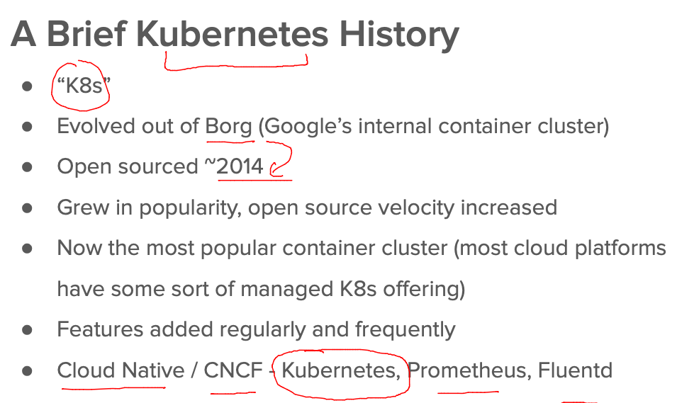

### k8s architecture 

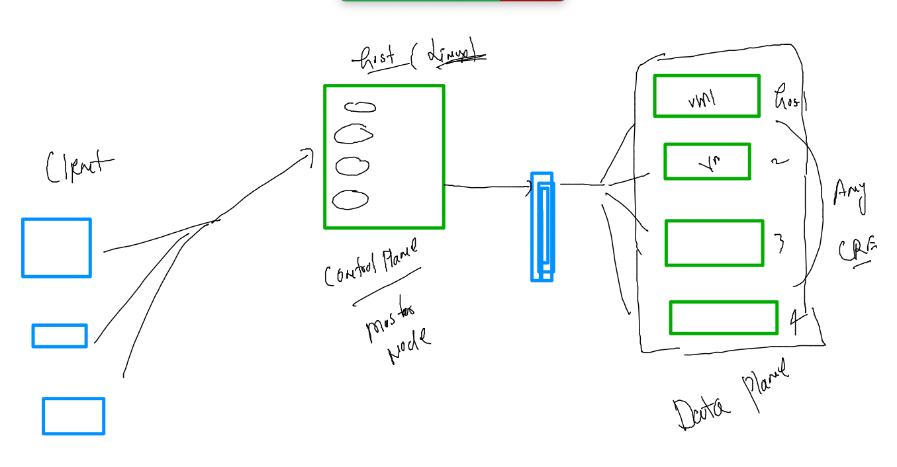

### k8s client side software check 

```
[ashu@k8s-client ~]$ kubectl version --client  -o json 
{
  "clientVersion": {
    "major": "1",
    "minor": "24",
    "gitVersion": "v1.24.1",
    "gitCommit": "3ddd0f45aa91e2f30c70734b175631bec5b5825a",
    "gitTreeState": "clean",
    "buildDate": "2022-05-24T12:26:19Z",
    "goVersion": "go1.18.2",
    "compiler": "gc",
    "platform": "linux/amd64"
  },
  "kustomizeVersion": "v4.5.4"
}
[ashu@k8s-client ~]$ kubectl version --client  -o yaml 
clientVersion:
  buildDate: "2022-05-24T12:26:19Z"
  compiler: gc
  gitCommit: 3ddd0f45aa91e2f30c70734b175631bec5b5825a
  gitTreeState: clean
  gitVersion: v1.24.1
  goVersion: go1.18.2
  major: "1"
  minor: "24"
  platform: linux/amd64
```

### master Node wiil have kube-apiserver 

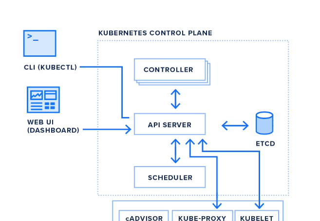

### sending api server 

```
 kubectl   get   nodes 
The connection to the server localhost:8080 was refused - did you specify the right host or port?
[ashu@k8s-client ~]$ kubectl   get   nodes   --kubeconfig  admin.conf  
NAME            STATUS   ROLES           AGE    VERSION
control-plane   Ready    control-plane   159m   v1.24.1
node1           Ready    <none>          158m   v1.24.1
node2           Ready    <none>          158m   v1.24.1

```

### checking request from client

```
ls
admin.conf  app_images
[ashu@k8s-client ~]$ kubectl   get   nodes   --kubeconfig  admin.conf  
NAME            STATUS   ROLES           AGE    VERSION
control-plane   Ready    control-plane   160m   v1.24.1
node1           Ready    <none>          160m   v1.24.1
node2           Ready    <none>          159m   v1.24.1
[ashu@k8s-client ~]$ kubectl cluster-info    --kubeconfig  admin.conf  
Kubernetes control plane is running at https://172.31.80.21:6443
CoreDNS is running at https://172.31.80.21:6443/api/v1/namespaces/kube-system/services/kube-dns:dns/proxy

To further debug and diagnose cluster problems, use 'kubectl cluster-info dump'.
[ashu@k8s-client ~]$ 


```

### setting .kube/config 

```
 kubectl cluster-info    --kubeconfig  admin.conf  
Kubernetes control plane is running at https://172.31.80.21:6443
CoreDNS is running at https://172.31.80.21:6443/api/v1/namespaces/kube-system/services/kube-dns:dns/proxy

To further debug and diagnose cluster problems, use 'kubectl cluster-info dump'.
[ashu@k8s-client ~]$ 
[ashu@k8s-client ~]$ 
[ashu@k8s-client ~]$ 
[ashu@k8s-client ~]$ mkdir  ~/.kube
mkdir: cannot create directory '/home/ashu/.kube': File exists
[ashu@k8s-client ~]$ 
[ashu@k8s-client ~]$ cp  admin.conf   ~/.kube/config  
[ashu@k8s-client ~]$ 
[ashu@k8s-client ~]$ kubectl   get  nodes
NAME            STATUS   ROLES           AGE    VERSION
control-plane   Ready    control-plane   163m   v1.24.1
node1           Ready    <none>          162m   v1.24.1
node2           Ready    <none>          162m   v1.24.1
[ashu@k8s-client ~]$ 


```

### k8s is databse nosql based storage 

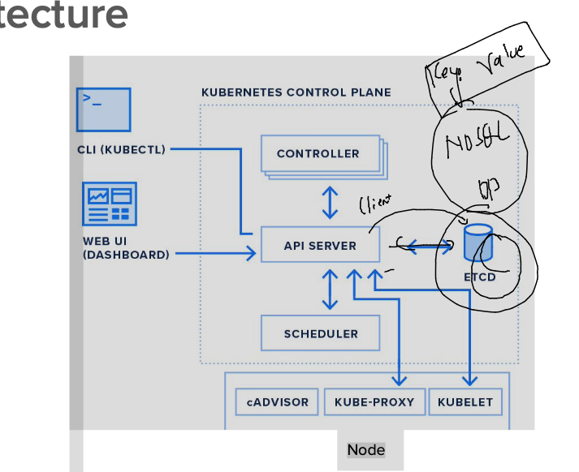

### k8s control plane -- Schedular. --

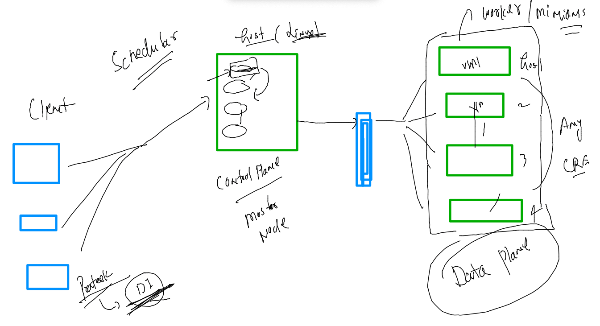

## Deploy application using POd concept 

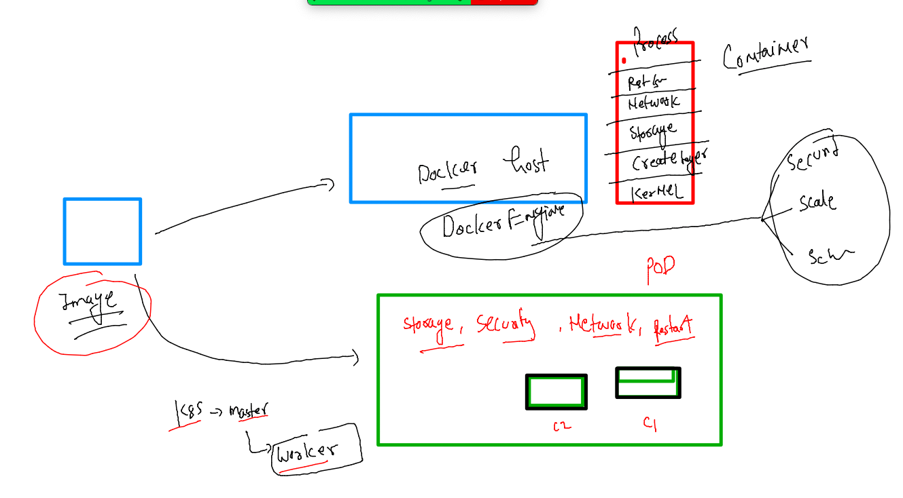

### kube-apiserver in different way 

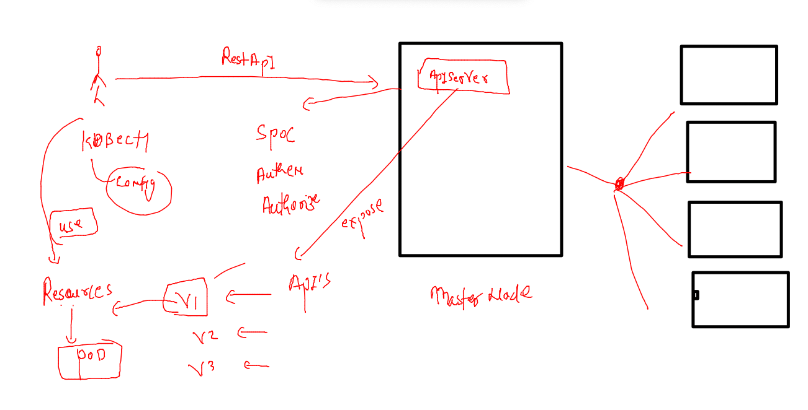

### Design first POD 

```
[ashu@k8s-client ~]$ mkdir yamls 
[ashu@k8s-client ~]$ cd  yamls/
[ashu@k8s-client yamls]$ ls
[ashu@k8s-client yamls]$ vim ashupod1.yaml 


[ashu@k8s-client yamls]$ cat  ashupod1.yaml 
apiVersion: v1
kind: Pod
metadata: # info about resource 
  name: ashupod1 
spec: # info about your application
  containers:
  - name: ashuc1 
    image: dockerashu/ashuwebapp:v2
    ports: 
    - containerPort: 80
    
    
[ashu@k8s-client yamls]$ kubectl create  -f  ashupod1.yaml 
pod/ashupod1 created
[ashu@k8s-client yamls]$ kubectl get  pods 
NAME       READY   STATUS    RESTARTS   AGE
ashupod1   1/1     Running   0          5s
[ashu@k8s-client yamls]$ 

```

### pod more commands 
```
kubectl  get  pods -o wide 
NAME          READY   STATUS    RESTARTS   AGE     IP                NODE    NOMINATED NODE   READINESS GATES
ashupod1      1/1     Running   0          20m     192.168.166.131   node1   <none>           <none>
mousumipod1   1/1     Running   0          3m38s   192.168.166.133   node1   <none>           <none>
pratpod1      1/1     Running   0          14m     192.168.166.132   node1   <none>           <none>
tanvipod1     1/1     Running   0          9m35s   192.168.104.6     node2   <none>           <none>

```

### Describe pod 

```
kubectl  describe  pod  ashupod1
Name:         ashupod1
Namespace:    default
Priority:     0
Node:         node1/172.31.94.94
Start Time:   Tue, 31 May 2022 08:48:09 +0000
Labels:       <none>
Annotations:  cni.projectcalico.org/containerID: 5360ab2d5f8e9af6b2e39dc9a7821d23b565a651e91a7c902e89355667fc305c
              cni.projectcalico.org/podIP: 192.168.166.131/32
              cni.projectcalico.org/podIPs: 192.168.166.131/32
Status:       Running
IP:           192.168.166.131
IPs:
  IP:  192.168.166.131
Containers:
  ashuc1:
    Container ID:   containerd://a8182344de9219a1cb5ead7d0ad6b07fa7433a947146265c58079b417c4a599f
    Image:          dockerashu/ashuwebapp:v2
    Image ID:       docker.io/dockerashu/ashuwebapp@sha256:300162b15fa401cfc81652a24ff5626e6668814ce150b1f0636cf7969ddeca23
    Port:           80/TCP
    Host Port:      0/TCP

```

### accessing container shell

```
 kubectl  exec  -it  ashupod1  -- bash 
root@ashupod1:/# 
root@ashupod1:/# 
root@ashupod1:/# ls
bin   dev		   docker-entrypoint.sh  home  lib64  mnt  proc  run   srv  tmp  var
boot  docker-entrypoint.d  etc			 lib   media  opt  root  sbin  sys  usr
root@ashupod1:/# exit
exit

```

### Delete pods 

```
 kubectl  delete pod mousumipod1
pod "mousumipod1" deleted
[ashu@k8s-client yamls]$ kubectl  get  pods
NAME        READY   STATUS    RESTARTS   AGE
ashupod1    1/1     Running   0          4m42s
pratpod1    1/1     Running   0          3m33s
tanvipod1   1/1     Running   0          3m23s
[ashu@k8s-client yamls]$ 
[ashu@k8s-client yamls]$ ls
ashupod1.yaml
[ashu@k8s-client yamls]$ kubectl delete -f ashupod1.yaml 
pod "ashupod1" deleted
[ashu@k8s-client yamls]$ kubectl  get  pods
NAME        READY   STATUS    RESTARTS   AGE
pratpod1    1/1     Running   0          3m48s
tanvipod1   1/1     Running   0          3m38s

```

### auto generate YAML --

```
[ashu@k8s-client yamls]$ kubectl  run  ashupod2 --image=dockerashu/ashuwebapp:v2 --port 80  --dry-run=client -o yaml 
apiVersion: v1
kind: Pod
metadata:
  creationTimestamp: null
  labels:
    run: ashupod2
  name: ashupod2
spec:
  containers:
  - image: dockerashu/ashuwebapp:v2
    name: ashupod2
    ports:
    - containerPort: 80
    resources: {}
  dnsPolicy: ClusterFirst
  restartPolicy: Always
status: {}

[ashu@k8s-client yamls]$ kubectl  run  ashupod2 --image=dockerashu/ashuwebapp:v2 --port 80  --dry-run=client -o yaml  >pod2.yaml 
```

### Deploy POD yaml 

```
kubectl create -f  pod2.yaml  
pod/ashupod2 created
[ashu@k8s-client yamls]$ kubectl  get  pods
NAME       READY   STATUS    RESTARTS   AGE
ashupod2   1/1     Running   0          4s
[ashu@k8s-client yamls]$ 
```
### POds container process control 

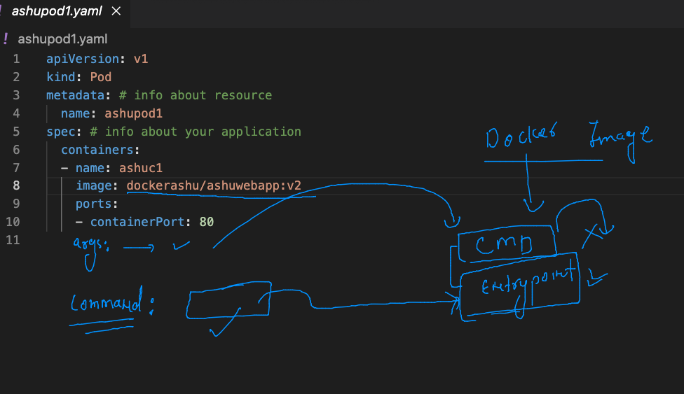

## Networking in kubernetes 

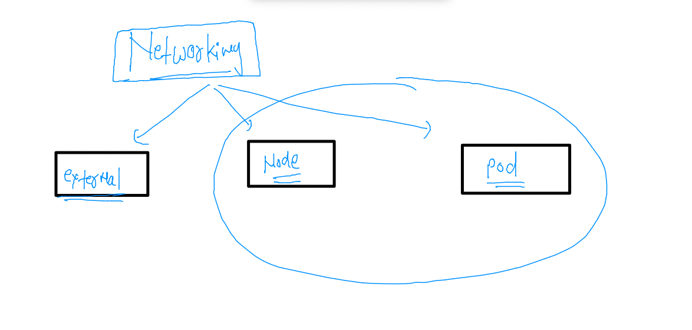

### k8s networking labels 

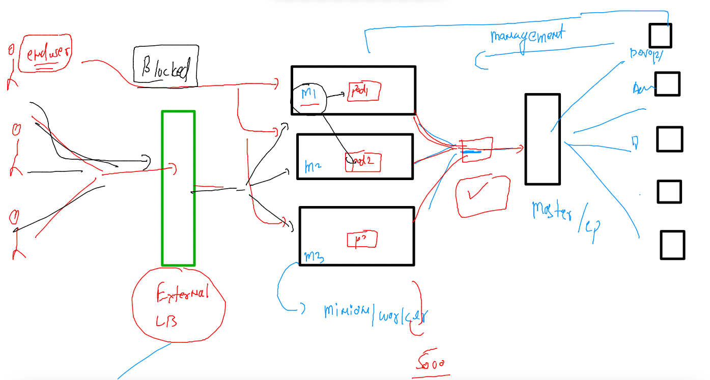

### Container networking in overall way 

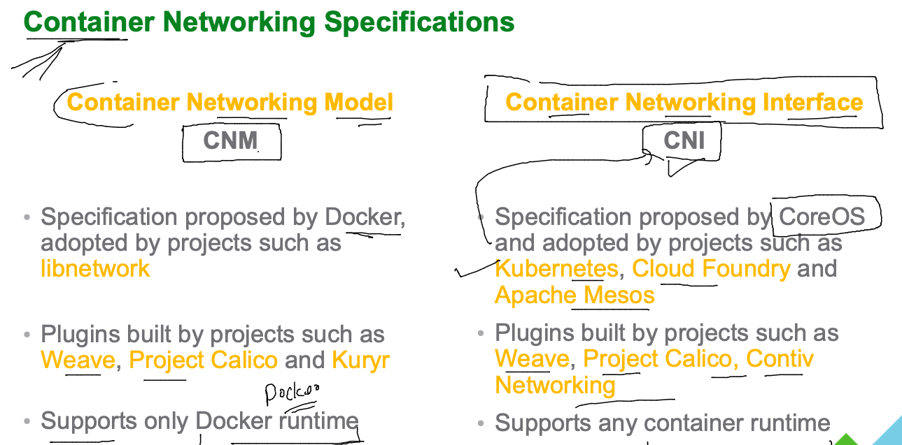

### CNI bridge in k8s 

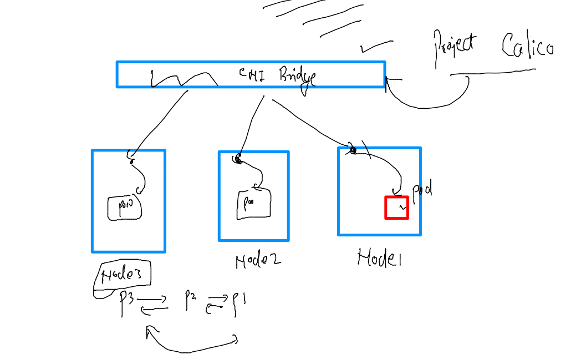

### pods from Different Nodes they can communicate to eathOther 

```
 kubectl run  test-network --image=alpine --command ping localhost 
pod/test-network created
[ashu@k8s-client python_images]$ kubectl get po -owide
NAME           READY   STATUS    RESTARTS   AGE     IP                NODE    NOMINATED NODE   READINESS GATES
ashupod1       1/1     Running   0          2m39s   192.168.166.143   node1   <none>           <none>
mousumipod11   1/1     Running   0          57s     192.168.166.145   node1   <none>           <none>
pratpod1       1/1     Running   0          95s     192.168.104.10    node2   <none>           <none>
tanvipod1      1/1     Running   0          2m18s   192.168.166.144   node1   <none>           <none>
test-network   1/1     Running   0          7s      192.168.104.11    node2   <none>           <none>
[ashu@k8s-client python_images]$ 
[ashu@k8s-client python_images]$ kubectl exec -it  test-network -- sh 
/ # 
/ # ping  192.168.166.145
PING 192.168.166.145 (192.168.166.145): 56 data bytes
64 bytes from 192.168.166.145: seq=0 ttl=62 time=0.641 ms
64 bytes from 192.168.166.145: seq=1 ttl=62 time=0.382 ms
^C
--- 192.168.166.145 ping statistics ---
2 packets transmitted, 2 packets received, 0% packet loss
round-trip min/avg/max = 0.382/0.511/0.641 ms


```
### networking details

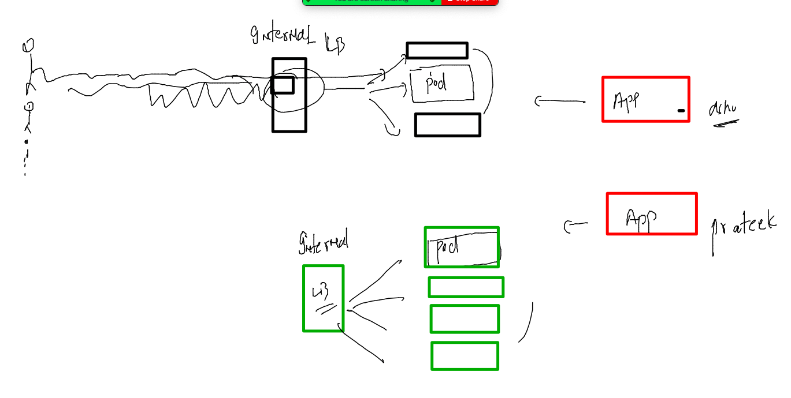

### Service Resources to create Internal LB 

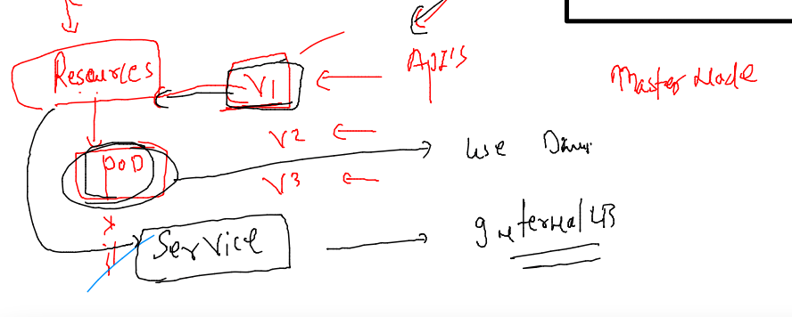

### type fo service 

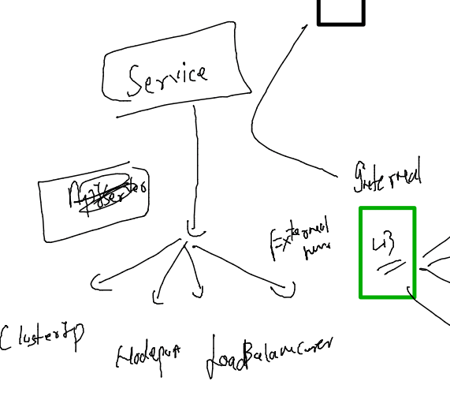

### pod to service --

```
kubectl get  po 
NAME           READY   STATUS    RESTARTS   AGE
ashupod1       1/1     Running   0          20m
mousumipod11   1/1     Running   0          19m
pratpod1       1/1     Running   0          19m
tanvipod1      1/1     Running   0          20m
test-network   1/1     Running   0          18m

==
kubectl   expose pod  ashupod1  --type NodePort  --port 80 --name ashulb1 
service/ashulb1 exposed
[ashu@k8s-client python_images]$ 
[ashu@k8s-client python_images]$ 
[ashu@k8s-client python_images]$ kubectl  get  service 
NAME         TYPE        CLUSTER-IP       EXTERNAL-IP   PORT(S)        AGE
ashulb1      NodePort    10.108.187.180   <none>        80:30040/TCP   9s
```


