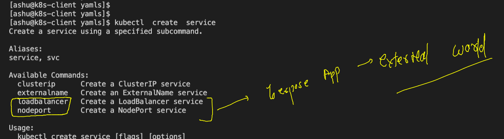
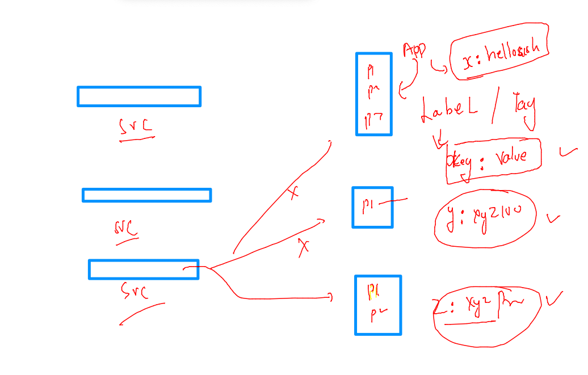
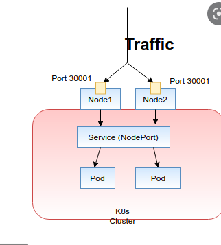
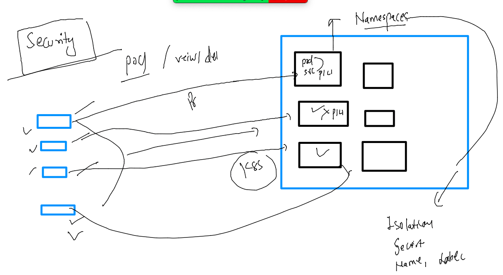
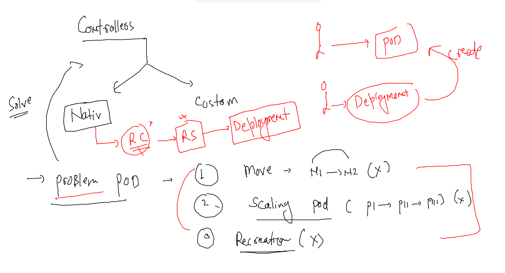
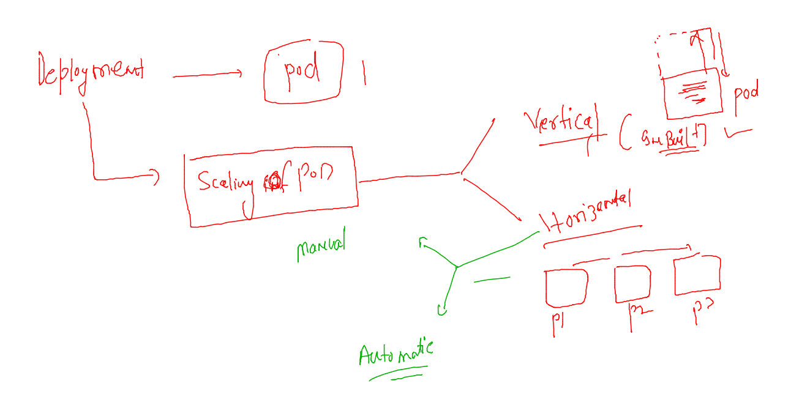
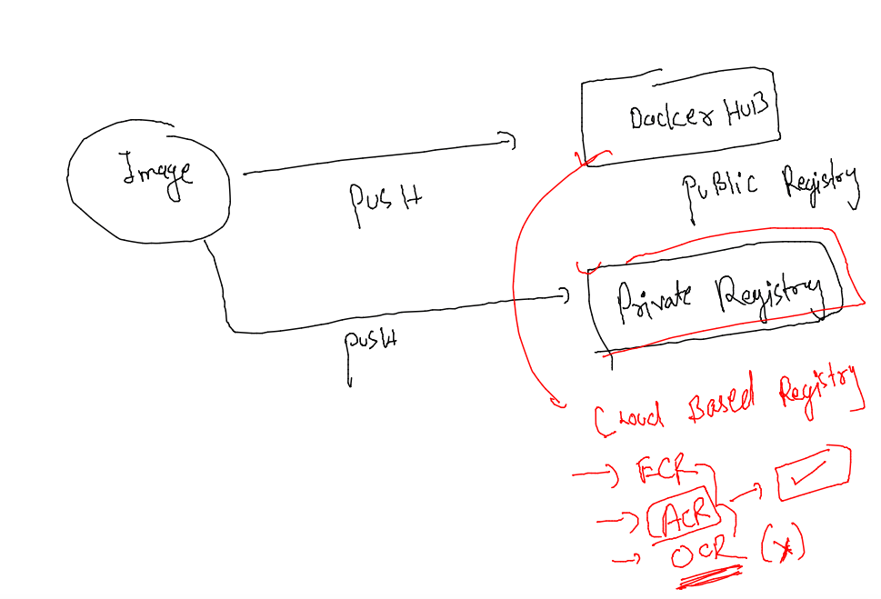
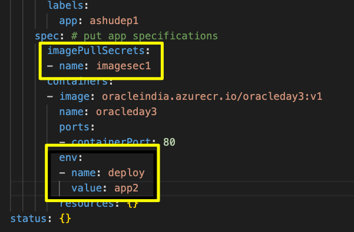
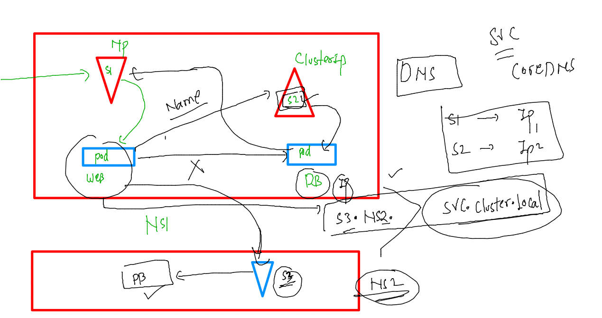

# oracle-dk-k8s-adv-30thmay2022

## plan 


## Creating service to access pod application 

### deploy a POD -- 

```
kubectl run  ashupod1 --image=dockerashu/ashuwebapp:v2 --port 80 --dry-run=client -o yaml  >day3pod.yaml

====
kubectl  create  -f  day3pod.yaml 
pod/ashupod1 created
[ashu@k8s-client yamls]$ kubectl  get pods
NAME       READY   STATUS    RESTARTS   AGE
ashupod1   1/1     Running   0          3s

```

### to expose pod app to external world -- below service will be responsible 



```
[ashu@k8s-client yamls]$ kubectl  create  service  nodeport ashulb1  --tcp  1234:80  --dry-run=client -o yaml 
apiVersion: v1
kind: Service
metadata:
  creationTimestamp: null
  labels:
    app: ashulb1
  name: ashulb1
spec:
  ports:
  - name: 1234-80
    port: 1234
    protocol: TCP
    targetPort: 80
  selector:
    app: ashulb1
  type: NodePort
status:
  loadBalancer: {}
[ashu@k8s-client yamls]$ kubectl  create  service  nodeport ashulb1  --tcp  1234:80  --dry-run=client -o yaml >nodeport.yaml
[ashu@k8s-client yamls]$ 

```

### Nodeport service --


### service will find pod using label 



```
kubectl get po   ashupod1  --show-labels 
NAME       READY   STATUS    RESTARTS   AGE   LABELS
ashupod1   1/1     Running   0          24m   run=ashupod1
[ashu@k8s-client ~]$ 

```

### udpating selector section of pod 

```
kubectl replace -f  nodeport.yaml  --force
service "ashulb1" deleted
```

###

```
 kubectl get po   ashupod1  --show-labels 
NAME       READY   STATUS    RESTARTS   AGE   LABELS
ashupod1   1/1     Running   0          24m   run=ashupod1
[ashu@k8s-client ~]$ kubectl get svc -owide

[ashu@k8s-client ~]$ kubectl get svc -owide
NAME         TYPE        CLUSTER-IP       EXTERNAL-IP   PORT(S)          AGE    SELECTOR
ashulb1      NodePort    10.108.35.230    <none>        1234:32422/TCP   115s   run=ashupod1
```


### Nodeport service View 



### namespaces in k8s 



### list of existing namespaces

```
[ashu@k8s-client ~]$ kubectl get  ns
NAME                   STATUS   AGE
default                Active   26h
kube-node-lease        Active   26h
kube-public            Active   26h
kube-system            Active   26h
kubernetes-dashboard   Active   26h
[ashu@k8s-client ~]$ 
[ashu@k8s-client ~]$ 
[ashu@k8s-client ~]$ kubectl  get po -n kube-system 
NAME                                       READY   STATUS    RESTARTS       AGE
calico-kube-controllers-56cdb7c587-vkd5g   1/1     Running   1 (146m ago)   26h
calico-node-2zdfp                          1/1     Running   1 (146m ago)   26h
calico-node-hwd67                          1/1     Running   1 (146m ago)   26h
calico-node-hxvml                          1/1     Running   1 (146m ago)   26h
coredns-6d4b75cb6d-gsg5q                   1/1     Running   1 (146m ago)   26h
coredns-6d4b75cb6d-mf6fq                   1/1     Running   1 (146m ago)   26h
etcd-control-plane                         1/1     Running   1 (146m ago)   26h
kube-apiserver-control-plane               1/1     Running   1 (146m ago)   26h
kube-controller-manager-control-plane      1/1     Running   1 (146m ago)   26h

```

### creating ns

```
kubectl create  namespace  ashu-space  --dry-run=client -oyaml
apiVersion: v1
kind: Namespace
metadata:
  creationTimestamp: null
  name: ashu-space
spec: {}
status: {}
[ashu@k8s-client ~]$ kubectl create  namespace  ashu-space 
namespace/ashu-space created
[ashu@k8s-client ~]$ kubectl get  ns
NAME                   STATUS   AGE
ashu-space             Active   3s

```

### setting default namespaces 

```

[ashu@k8s-client ~]$ kubectl get  pods
No resources found in default namespace.
[ashu@k8s-client ~]$ 
[ashu@k8s-client ~]$ kubectl  config  set-context  --current --namespace=ashu-space
Context "kubernetes-admin@kubernetes" modified.
[ashu@k8s-client ~]$ 
[ashu@k8s-client ~]$ 
[ashu@k8s-client ~]$ kubectl get  pods
No resources found in ashu-space namespace.
[ashu@k8s-client ~]$ 
[ashu@k8s-client ~]$ kubectl config get-contexts 
CURRENT   NAME                          CLUSTER      AUTHINFO           NAMESPACE
*         kubernetes-admin@kubernetes   kubernetes   kubernetes-admin   ashu-space

```

### deploy pod and svc again 

```
 kubectl create -f  day3pod.yaml  -f  nodeport.yaml 
pod/ashupod1 created
service/ashulb1 created
[ashu@k8s-client yamls]$ kubectl   get  pods
NAME       READY   STATUS    RESTARTS   AGE
ashupod1   1/1     Running   0          8s
[ashu@k8s-client yamls]$ kubectl   get  svc
NAME      TYPE       CLUSTER-IP    EXTERNAL-IP   PORT(S)          AGE
ashulb1   NodePort   10.99.26.76   <none>        1234:31881/TCP   11s
[ashu@k8s-client yamls]$ 


```

### clean up 

```
 kubectl delete pod,svc --all
pod "ashupod1" deleted
service "ashulb1" deleted

```
### pod problems and Controllers in k8s 



### creation 

```
[ashu@k8s-client yamls]$ kubectl  get  deploy 
NAME          READY   UP-TO-DATE   AVAILABLE   AGE
ashudeploy1   1/1     1            1           8s
[ashu@k8s-client yamls]$ kubectl  get  po
NAME                           READY   STATUS    RESTARTS   AGE
ashudeploy1-78d9779666-24bt5   1/1     Running   0          37s
[ashu@k8s-client yamls]$ kubectl  delete pods ashudeploy1-78d9779666-24bt5
pod "ashudeploy1-78d9779666-24bt5" deleted
[ashu@k8s-client yamls]$ kubectl  get  po
NAME                           READY   STATUS    RESTARTS   AGE
ashudeploy1-78d9779666-5sf4x   1/1     Running   0          7s
[ashu@k8s-client yamls]$ 

```

### deploy access 



```
kubectl  get deplooy 
error: the server doesn't have a resource type "deplooy"
[ashu@k8s-client ~]$ kubectl  get deploy
NAME          READY   UP-TO-DATE   AVAILABLE   AGE
ashudeploy1   3/3     3            3           8m55s
[ashu@k8s-client ~]$ kubectl  get po --show-labels
NAME                           READY   STATUS    RESTARTS   AGE     LABELS
ashudeploy1-78d9779666-fjznd   1/1     Running   0          16s     app=ashudeploy1,pod-template-hash=78d9779666
ashudeploy1-78d9779666-gxgtd   1/1     Running   0          16s     app=ashudeploy1,pod-template-hash=78d9779666
ashudeploy1-78d9779666-l2nl6   1/1     Running   0          6m17s   app=ashudeploy1,pod-template-hash=78d9779666
[ashu@k8s-client ~]$ 


```

### creating service using deployment exposing 

```
kubectl  get  deploy 
NAME          READY   UP-TO-DATE   AVAILABLE   AGE
ashudeploy1   3/3     3            3           11m
[ashu@k8s-client ~]$ 

kubectl expose  deploy ashudeploy1  --type NodePort  --port 80 --name  ashulb2
service/ashulb2 exposed
[ashu@k8s-client ~]$ 
[ashu@k8s-client ~]$ kubectl delete svc ashulb1 
service "ashulb1" deleted
[ashu@k8s-client ~]$ kubectl  get  svc -owide
NAME      TYPE       CLUSTER-IP       EXTERNAL-IP   PORT(S)        AGE   SELECTOR
ashulb2   NodePort   10.108.193.204   <none>        80:32202/TCP   12s   app=ashudeploy1
[ashu@k8s-client ~]$ 

```
### clean namespace 

```
 kubectl delete all --all
pod "ashudeploy1-78d9779666-fjznd" deleted
pod "ashudeploy1-78d9779666-gxgtd" deleted
pod "ashudeploy1-78d9779666-l2nl6" deleted
service "lbsv1" deleted
deployment.apps "ashudeploy1" deleted
[ashu@k8s-client ~]$ 
[ashu@k8s-client ~]$ 
[ashu@k8s-client ~]$ kubectl  get  all
No resources found in ashu-space namespace.
[ashu@k8s-client ~]$ 


```
## pushing image to ACR -- private registry 



```

docker  tag  oracleday3:v1  oracleindia.azurecr.io/oracleday3:v1
 docker login  oracleindia.azurecr.io
Username: oracleindia
Password: 
WARNING! Your password will be stored unencrypted in /home/ashu/.docker/config.json.
Configure a credential helper to remove this warning. See
https://docs.docker.com/engine/reference/commandline/login/#credentials-store

Login Succeeded
[ashu@k8s-client multiapp]$ docker  push  oracleindia.azurecr.io/oracleday3:v1
The push refers to repository [oracleindia.azurecr.io/oracleday3]
90d0947109b0: Pushed 
fbb87d68389c: Pushed 

```

### Now deploy this to k8s 

```
kubectl  create deployment  ashudep1 --image=oracleindia.azurecr.io/oracleday3:v1  --port=80 --dry-run=client -oyaml  >acrdeploy.yaml
```

### creating secret 

```
kubectl  get secret  
No resources found in ashu-space namespace.
[ashu@k8s-client multiapp]$ kubectl create  secret  
Create a secret using specified subcommand.

Available Commands:
  docker-registry   Create a secret for use with a Docker registry
  generic           Create a secret from a local file, directory, or literal value
  tls               Create a TLS secret

Usage:
  kubectl create secret [flags] [options]

Use "kubectl <command> --help" for more information about a given command.
Use "kubectl options" for a list of global command-line options (applies to all commands).

```

### secret 

```
kubectl create  secret  docker-registry imagesec1  --docker-server=oracleindia.azurecr.io  --docker-username=oracleindia   --docker-password="xpu/ydA9LJG0xWVHaOj2bb9mWmq5pIif" 
secret/imagesec1 created
[ashu@k8s-client multiapp]$ 
[ashu@k8s-client multiapp]$ 
[ashu@k8s-client multiapp]$ kubectl get  secret  
NAME        TYPE                             DATA   AGE
imagesec1   kubernetes.io/dockerconfigjson   1      32s
[ashu@k8s-client multiapp]$ 


```

### deployment YAML -- 

```
apiVersion: apps/v1
kind: Deployment
metadata:
  creationTimestamp: null
  labels:
    app: ashudep1
  name: ashudep1
spec:
  replicas: 1
  selector:
    matchLabels:
      app: ashudep1
  strategy: {}
  template: # to create pod 
    metadata:
      creationTimestamp: null
      labels:
        app: ashudep1
    spec: # put app specifications 
      imagePullSecrets:
      - name: imagesec1
      containers:
      - image: oracleindia.azurecr.io/oracleday3:v1
        name: oracleday3
        ports:
        - containerPort: 80
        env: 
        - name: deploy 
          value: app2 
        resources: {}
status: {}


```

### 



### deploy webui in k8s cluster 

```
kubectl apply -f https://raw.githubusercontent.com/kubernetes/dashboard/v2.5.0/aio/deploy/recommended.yaml
namespace/kubernetes-dashboard created
serviceaccount/kubernetes-dashboard created
service/kubernetes-dashboard created
secret/kubernetes-dashboard-certs created
secret/kubernetes-dashboard-csrf created
secret/kubernetes-dashboard-key-holder created
configmap/kubernetes-dashboard-settings created
role.rbac.authorization.k8s.io/kubernetes-dashboard created
clusterrole.rbac.authorization.k8s.io/kubernetes-dashboard unchanged
rolebinding.rbac.authorization.k8s.io/kubernetes-dashboard created
clusterrolebinding.rbac.authorization.k8s.io/kubernetes-dashboard unchanged
deployment.apps/kubernetes-dashboard created
service/dashboard-metrics-scraper created
deployment.apps/dashboard-metrics-scraper created
[ashu@k8s-client multiapp]$ kubectl  get  ns 
NAME                   STATUS   AGE
ashu-space             Active   3h46m
default                Active   29h
kube-node-lease        Active   29h
kube-public            Active   29h
kube-system            Active   29h
kubernetes-dashboard   Active   7s

```

### changing service type to LB 

```
kubectl  -n kubernetes-dashboard get deploy 
NAME                        READY   UP-TO-DATE   AVAILABLE   AGE
dashboard-metrics-scraper   1/1     1            1           40s
kubernetes-dashboard        1/1     1            1           40s
[ashu@k8s-client multiapp]$ 
[ashu@k8s-client multiapp]$ kubectl  -n kubernetes-dashboard get po
NAME                                         READY   STATUS    RESTARTS   AGE
dashboard-metrics-scraper-7bfdf779ff-2jjcq   1/1     Running   0          47s
kubernetes-dashboard-6cdd697d84-5wjst        1/1     Running   0          47s
[ashu@k8s-client multiapp]$ kubectl  -n kubernetes-dashboard get  svc
NAME                        TYPE        CLUSTER-IP       EXTERNAL-IP   PORT(S)    AGE
dashboard-metrics-scraper   ClusterIP   10.108.177.161   <none>        8000/TCP   50s
kubernetes-dashboard        ClusterIP   10.106.220.37    <none>        443/TCP    50s
[ashu@k8s-client multiapp]$ kubectl  -n kubernetes-dashboard edit  svc kubernetes-dashboard
service/kubernetes-dashboard edited
[ashu@k8s-client multiapp]$ kubectl  -n kubernetes-dashboard get  svc
NAME                        TYPE           CLUSTER-IP       EXTERNAL-IP   PORT(S)         AGE
dashboard-metrics-scraper   ClusterIP      10.108.177.161   <none>        8000/TCP        2m42s
kubernetes-dashboard        LoadBalancer   10.106.220.37    <pending>     443:31067/TCP   2m42s
[ashu@k8s-client multiapp]$ 


```

### we need to create. dashboard token since 1.24 version of k8s (which is the most recent and stable version )

```
apiVersion: v1
kind: Secret
metadata:
  creationTimestamp: null
  name: mysecret
  namespace: kubernetes-dashboard
  annotations:
    kubernetes.io/service-account.name: "kubernetes-dashboard"
type: kubernetes.io/service-account-token

```

===
```
kubectl  apply -f  dash.yaml 
secret/mysecret created
[ashu@k8s-client yamls]$ 

kubectl  -n kubernetes-dashboard   get  secret
NAME                              TYPE                                  DATA   AGE
kubernetes-dashboard-certs        Opaque                                0      11m
kubernetes-dashboard-csrf         Opaque                                1      11m
kubernetes-dashboard-key-holder   Opaque                                2      11m
mysecret                          kubernetes.io/service-account-token   3      3s

```

### how to get token 

```
kubectl  -n kubernetes-dashboard describe   secret mysecret
Name:         mysecret
Namespace:    kubernetes-dashboard
Labels:       <none>
Annotations:  kubernetes.io/service-account.name: kubernetes-dashboard
              kubernetes.io/service-account.uid: d34b601d-4cdf-4179-bf3f-b76c2cbf40b1

Type:  kubernetes.io/service-account-token

Data
====
namespace:  20 bytes
token:      eyJhbGciOiJSUzI1NiIsImtpZCI6InNuQ1dUMUdIanJvaWlDWTNONzVxNkV3QkFkMDljUmhLUnQxdHg2ZVh3QnMifQ.eyJpc3MiOiJrdWJlcm5ldGVzL3NlcnZpY2VhY2NvdW50Iiwia3ViZXJ
```
### DNS Understanding using two tier webapplication 


### webapp-db-client deploy 

```
kubectl  create deploy  db-client --image=adminer  --port 8080 
deployment.apps/db-client created
[ashu@k8s-client yamls]$ kubectl   get  deploy 
NAME        READY   UP-TO-DATE   AVAILABLE   AGE
db-client   1/1     1            1           6s
[ashu@k8s-client yamls]$ kubectl   get  po 
NAME                         READY   STATUS    RESTARTS   AGE
db-client-69c4f4d48c-stpxj   1/1     Running   0          11s
[ashu@k8s-client yamls]$ kubectl   expose  deploy db-client --type NodePort --port 8080 --name lb1 
service/lb1 exposed
[ashu@k8s-client yamls]$ kubectl  get  svc 
NAME   TYPE       CLUSTER-IP       EXTERNAL-IP   PORT(S)          AGE
lb1    NodePort   10.110.139.187   <none>        8080:32231/TCP   5s

```

### database deployment 

#### creating secret and deployment in a single YAML file 

```
apiVersion: v1
kind: Secret
metadata:
  creationTimestamp: null
  name: ashu-db-sec # name of secret 
data: # to store secret data 
  sqlpass: RG9ja2VyQDA5OSM= 

---

apiVersion: apps/v1
kind: Deployment
metadata:
  creationTimestamp: null
  labels:
    app: ashudb
  name: ashudb
spec:
  replicas: 1
  selector:
    matchLabels:
      app: ashudb
  strategy: {}
  template: # for pod creation 
    metadata:
      creationTimestamp: null
      labels:
        app: ashudb
    spec:
      containers:
      - image: mysql
        name: mysql
        ports:
        - containerPort: 3306
        env: # to use / create env variable 
        - name: MYSQL_ROOT_PASSWORD
          valueFrom:  # reading value from secret 
            secretKeyRef:
              name: ashu-db-sec # name of secret 
              key: sqlpass # key of secret data 
        resources: {}
status: {}

---
apiVersion: v1
kind: Service
metadata:
  creationTimestamp: null
  labels:
    app: ashdb-svc
  name: ashdb-svc
spec:
  ports:
  - name: 3306-3306
    port: 3306
    protocol: TCP
    targetPort: 3306
  selector:
    app: ashdb-svc
  type: ClusterIP
status:
  loadBalancer: {}
```
### Deploy YAML 

```
[ashu@k8s-client yamls]$ kubectl  create -f db_deploy.yaml 
secret/ashu-db-sec created
deployment.apps/ashudb created
service/ashdb-svc created
[ashu@k8s-client yamls]$ kubectl  get  secret 
NAME          TYPE     DATA   AGE
ashu-db-sec   Opaque   1      8s
[ashu@k8s-client yamls]$ kubectl  get  deploy
NAME        READY   UP-TO-DATE   AVAILABLE   AGE
ashudb      1/1     1            1           13s
db-client   1/1     1            1           18m
[ashu@k8s-client yamls]$ kubectl  get  svc
NAME        TYPE        CLUSTER-IP       EXTERNAL-IP   PORT(S)          AGE
ashdb-svc   ClusterIP   10.96.43.50      <none>        3306/TCP         16s
lb1         NodePort    10.110.139.187   <none>        8080:32231/TCP   18m
[ashu@k8s-client yamls]$ 

```

### svc with Dns understanding 




