# oracle-dk-k8s-adv-30thmay2022

## plan 


### any application can run in container by following below process 

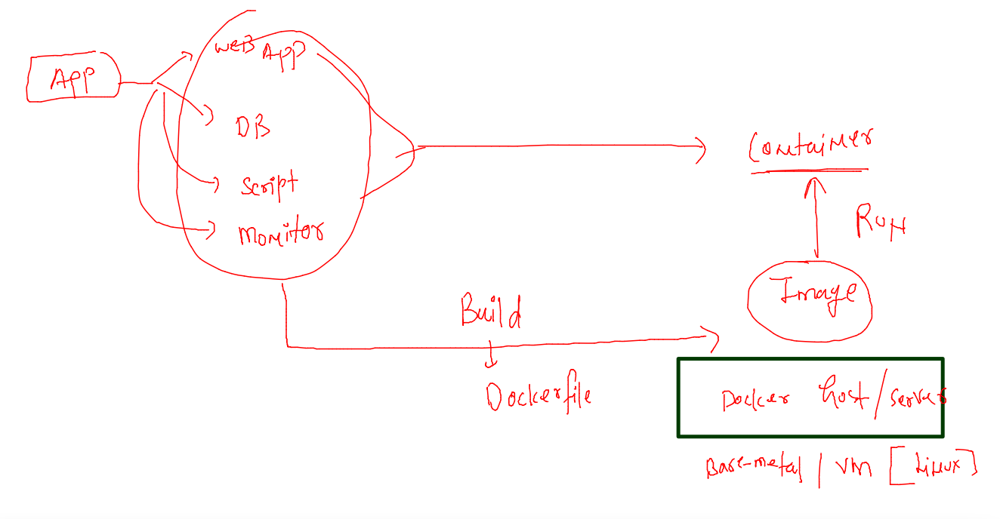

### container runtimes intro

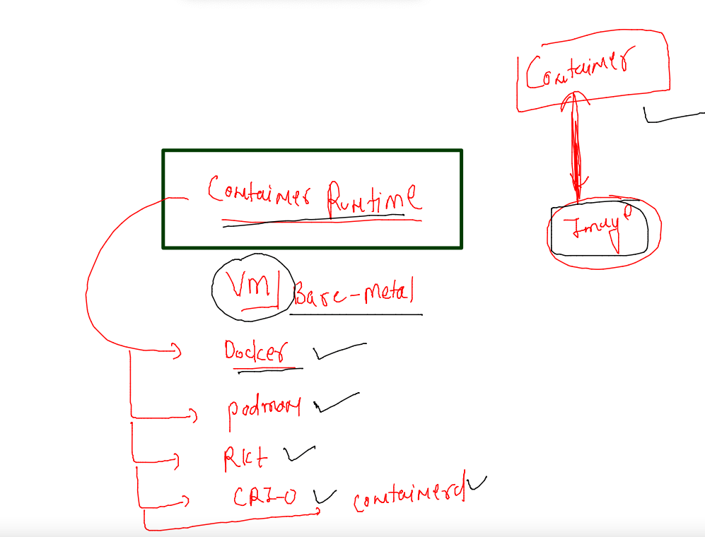

### Docker architecture 

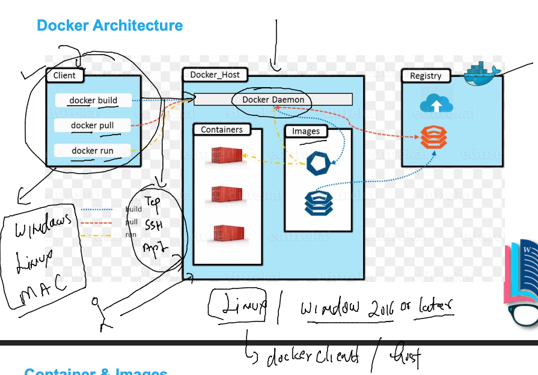

### Docker Installation on VM 

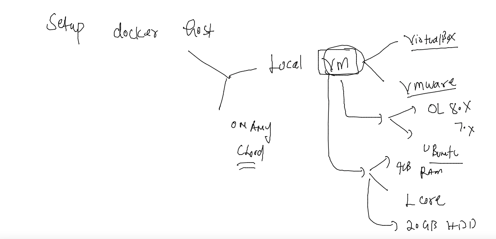

### Install docker on OL (7.x)/ CENTOS / rhel cloud based VM 

```
[root@docker-host ~]# yum  install  docker  -y
Failed to set locale, defaulting to C
Loaded plugins: extras_suggestions, langpacks, priorities, update-motd
amzn2-core                                                                                                         | 3.7 kB  00:00:00     
Resolving Dependencies
--> Running transaction check
---> Package docker.x86_64 0:20.10.13-2.amzn2 will be installed
--> Processing Dependency: runc >= 1.0.0 for package: docker-20.10.13-2.amzn2.x86_64
--> Processing Dependency: libcgroup >= 0.40.rc1-5.15 for package: docker-20.10.13-2.amzn2.x86_64
--> Processing Dependency: containerd >= 1.3.2 for package: docker-20.10.13-2.amzn2.x86_64
--> Processing Dependency: pigz for package: docker-20.10.13-2.amzn2.x86_64
--> Running transaction check
---> Package containerd.x86_64 0:1.4.13-2.amzn2.0.1 will be installed
---> Package libcgroup.x86_64 0:0.41-21.amzn2 will be installed
---> Package pigz.x86_64 0:2.3.4-1.amzn2.0.1 will be installed
---> Package runc.x86_64 0:1.0.3-2.amzn2 will be installed
--> Finished Dependency Resolution
```

### activate Docker service 

```
systemctl enable --now docker 
```

### setup non root users for docker access purpose 

```
 for  i in  ashu  prateek mousumi nishtha tanvi 
> do
> useradd $i
> echo "Docker@099#"  |  passwd  $i --stdin 
> usermod -aG docker $i
> done 
Changing password for user ashu.
passwd: all authentication tokens updated successfully.
Changing password for user prateek.
passwd: all authentication tokens updated successfully.
Changing password for user mousumi.
passwd: all authentication tokens updated successfully.
Changing password for user nishtha.
passwd: all authentication tokens updated successfully.
Changing password for user tanvi.
passwd: all authentication tokens updated successfully.
```

### verify docker client with non root users 

```
ssh  ashu@34.231.236.153
ashu@34.231.236.153's password: 

       __|  __|_  )
       _|  (     /   Amazon Linux 2 AMI
      ___|\___|___|

https://aws.amazon.com/amazon-linux-2/
2 package(s) needed for security, out of 6 available
Run "sudo yum update" to apply all updates.
-bash: warning: setlocale: LC_CTYPE: cannot change locale (UTF-8): No such file or directory
[ashu@docker-host ~]$ 
[ashu@docker-host ~]$ 
[ashu@docker-host ~]$ whoami
ashu
[ashu@docker-host ~]$ docker  version 
Client:
 Version:           20.10.13
 API version:       1.41
 Go version:        go1.16.15
 Git commit:        a224086
 Built:             Thu Mar 31 19:20:32 2022
 OS/Arch:           linux/amd64
 Context:           default
 Experimental:      true

Server:
 Engine:
  Version:          20.10.13
  API version:      1.41 (minimum version 1.12)
  Go version:       go1.16.15
  Git commit:       906f57f
  Built:            Thu Mar 31 19:21:13 2022
  OS/Arch:          linux/amd64
  Experimental:     false
 containerd:
  Version:          1.4.13
  GitCommit:        9cc61520f4cd876b86e77edfeb88fbcd536d1f9d
 runc:
  Version:          1.0.3
  GitCommit:        f46b6ba2c9314cfc8caae24a32ec5fe9ef1059fe
 docker-init:
  Version:          0.19.0
  GitCommit:        de40ad0
[ashu@docker-host ~]$ 

```

### Note: if you are using OCI -- then VM of OL 7.x is required -- OL 8.x --default container runtime is podman 

### Docker host setup on Local VM 

[URL](https://docs.docker.com/engine/install/)


### application containerization 

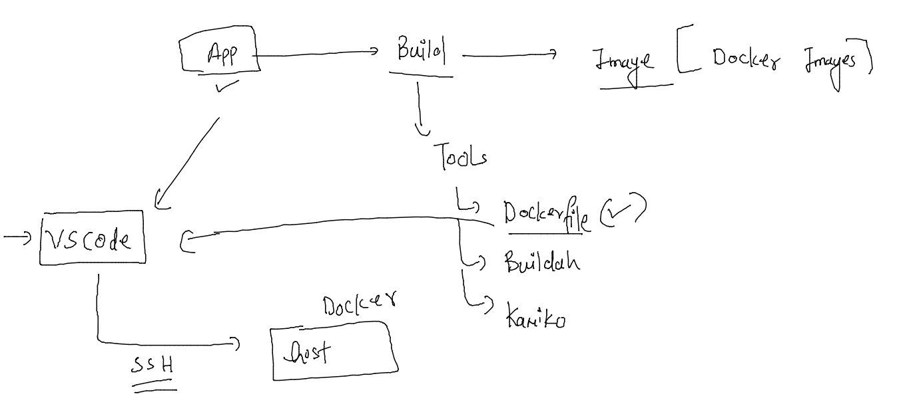

## application containerization 

### sample frontend app containerization 

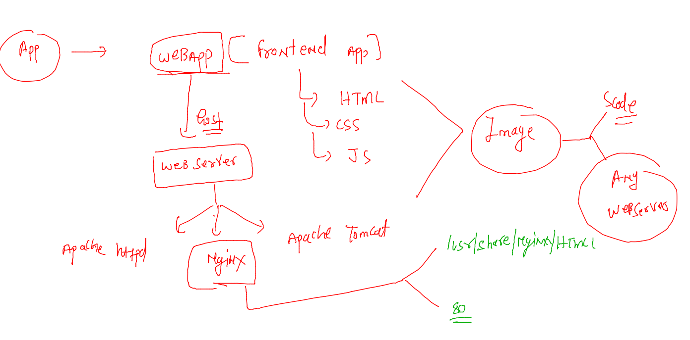

### creating app to docker image 

#### step 1  - cloning app 

```
 git clone  https://github.com/microsoft/project-html-website
Cloning into 'project-html-website'...
remote: Enumerating objects: 19, done.
remote: Total 19 (delta 0), reused 0 (delta 0), pack-reused 19
Receiving objects: 100% (19/19), 462.63 KiB | 25.70 MiB/s, done.
[ashu@docker-host webapp1]$ ls
project-html-website
[ashu@docker-host webapp1]$ 


```

#### step 2 :- dockerfile write 

```
[ashu@docker-host webapp1]$ cat  Dockerfile 
FROM nginx 
#  we are pulling default nginx server image from Docker hub 
LABEL name=ashutoshh
LABEL email=ashutoshh@linux.com
# to share your contact details with image users 
COPY project-html-website  /usr/share/nginx/html/

```

### step 3. -- all the data 

```
ls  -a
.  ..  .dockerignore  Dockerfile  project-html-website
[ashu@docker-host webapp1]$ cat  Dockerfile 
FROM nginx 
#  we are pulling default nginx server image from Docker hub 
LABEL name=ashutoshh
LABEL email=ashutoshh@linux.com
# to share your contact details with image users 
COPY project-html-website  /usr/share/nginx/html/
[ashu@docker-host webapp1]$ 
[ashu@docker-host webapp1]$ 
[ashu@docker-host webapp1]$ ls  -al  project-html-website/
total 12
drwxrwxr-x 6 ashu ashu  103 May 30 05:28 .
drwxrwxr-x 3 ashu ashu   73 May 30 05:36 ..
drwxrwxr-x 8 ashu ashu  163 May 30 05:28 .git
-rw-rw-r-- 1 ashu ashu 1087 May 30 05:28 LICENSE
-rw-rw-r-- 1 ashu ashu  710 May 30 05:28 README.md
drwxrwxr-x 2 ashu ashu   22 May 30 05:28 css
drwxrwxr-x 2 ashu ashu   26 May 30 05:28 fonts
drwxrwxr-x 2 ashu ashu  147 May 30 05:28 img
-rw-rw-r-- 1 ashu ashu 2866 May 30 05:28 index.html
[ashu@docker-host webapp1]$ cat  .dockerignore 
project-html-website/.git
project-html-website/*.md
project-html-website/LICENSE


```


### Step 4 docker image build 

```
 ls -a
.  ..  .dockerignore  Dockerfile  project-html-website
[ashu@docker-host webapp1]$ docker  build  -t   ashuwebapp:v1   . 
Sending build context to Docker daemon    834kB
Step 1/4 : FROM nginx
latest: Pulling from library/nginx
42c077c10790: Pull complete 
62c70f376f6a: Pull complete 
915cc9bd79c2: Pull complete 
75a963e94de0: Pull complete 
7b1fab684d70: Pull complete 
db24d06d5af4: Pull complete 
Digest: sha256:2bcabc23b45489fb0885d69a06ba1d648aeda973fae7bb981bafbb884165e514
Status: Downloaded newer image for nginx:latest
 ---> 0e901e68141f
Step 2/4 : LABEL name=ashutoshh
 ---> Running in 3ed21c68ac78
Removing intermediate container 3ed21c68ac78
 ---> a0575e7cba94
Step 3/4 : LABEL email=ashutoshh@linux.com
 ---> Running in 8c2c848b6860
Removing intermediate container 8c2c848b6860
 ---> 6ad5bd1160ec
Step 4/4 : COPY project-html-website  /usr/share/nginx/html/
 ---> 67edff2e4744
Successfully built 67edff2e4744
Successfully tagged ashuwebapp:v1


```

### checking images 

```
docker  images
REPOSITORY    TAG       IMAGE ID       CREATED          SIZE
tanviwebapp   v1        0dffcbf4b211   23 seconds ago   142MB
ashuwebapp    v1        67edff2e4744   47 seconds ago   142MB
nginx         latest    0e901e68141f   2 days ago       142MB

```
### creating container to access sample webapp 

```
 docker  images
REPOSITORY      TAG       IMAGE ID       CREATED          SIZE
pratwebapp      v1        e28b09b0fcc0   24 minutes ago   142MB
tanviwebapp     v1        0dffcbf4b211   27 minutes ago   142MB
ashuwebapp      v1        67edff2e4744   28 minutes ago   142MB
mousumiwebapp   v1        67edff2e4744   28 minutes ago   142MB
nginx           latest    0e901e68141f   2 days ago       142MB
[ashu@docker-host webapp1]$ docker  run   -d  --name ashuc1  -p  1122:80   ashuwebapp:v1  
854758237b085847fabe6043d379c41280c2b29fad29a7c14afd32b36d8965f1
[ashu@docker-host webapp1]$ 
[ashu@docker-host webapp1]$ docker  ps
CONTAINER ID   IMAGE           COMMAND                  CREATED         STATUS         PORTS                                   NAMES
854758237b08   ashuwebapp:v1   "/docker-entrypoint.…"   5 seconds ago   Up 4 seconds   0.0.0.0:1122->80/tcp, :::1122->80/tcp   ashuc1
[ashu@docker-host webapp1]$ 


```

### clean up 

```
[ashu@docker-host webapp1]$ docker kill  ashuc1   # stop container 
ashuc1
[ashu@docker-host webapp1]$ docker rm  ashuc1 # remove container 
ashuc1
[ashu@dock

```
### image sharing between / among docker Host 

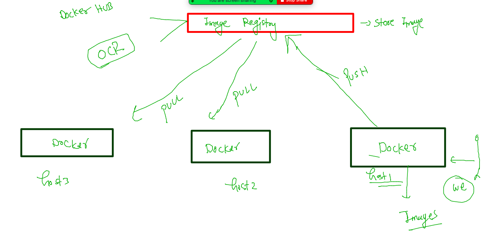

### pushing iamge to docker hub 

<ol>
  <li> create / sing in in Docker hub account </li>
 <li> convert image to docker hub format  </li>
 <li> login to docker hub account from docker client </li>
 <li> push image to docker hub  </li>
<li> you can logout from docker hub  </li> 
</ol>

### tagging image 

```
 docker   tag       ashuwebapp:v2           docker.io/dockerashu/ashuwebapp:v2 
```

### login to docker hub 

```
[ashu@docker-host webapp1]$ docker  login 
Login with your Docker ID to push and pull images from Docker Hub. If you don't have a Docker ID, head over to https://hub.docker.com to create one.
Username: dockerashu
Password: 
WARNING! Your password will be stored unencrypted in /home/ashu/.docker/config.json.
Configure a credential helper to remove this warning. See
https://docs.docker.com/engine/reference/commandline/login/#credentials-store

Login Succeeded
```

### pushing imaget to docker hub 

```
 docker  push  docker.io/dockerashu/ashuwebapp:v2 
The push refers to repository [docker.io/dockerashu/ashuwebapp]
fb1ca1535d3e: Pushed 
33e3df466e11: Mounted from library/nginx 
747b7a567071: Mounted from library/nginx 
57d3fc88cb3f: Mounted from library/nginx 
53ae81198b64: Mounted from library/nginx 
58354abe5f0e: Mounted from library/nginx 
ad6562704f37: Mounted from library/nginx 
v2: digest: sha256:300162b15fa401cfc81652a24ff5626e6668814ce150b1f0636cf7969ddeca23 size: 1780
```

### logout 

```
docker logout 
Removing login credentials for https://index.docker.io/v1/
```

### solution to question 

```
 docker run -itd  --name ashuc1  alpine sleep  10000
Unable to find image 'alpine:latest' locally
latest: Pulling from library/alpine
2408cc74d12b: Pull complete 
Digest: sha256:686d8c9dfa6f3ccfc8230bc3178d23f84eeaf7e457f36f271ab1acc53015037c
Status: Downloaded newer image for alpine:latest
bcabc3650ccee235a3ea3b70375f7456121d00be8365541fdf4247d18e8a7732
[ashu@docker-host webapp1]$ 
[ashu@docker-host webapp1]$ 
[ashu@docker-host webapp1]$ docker run -itd  --name ashuc2  alpine sleep  10000
524e88f5f8ea9e1ffb4e94768d6e5e5f481a53b97554f097be34408449557c14
[ashu@docker-host webapp1]$ docker  ps
CONTAINER ID   IMAGE              COMMAND                  CREATED          STATUS          PORTS                                   NAMES
524e88f5f8ea   alpine             "sleep 10000"            2 seconds ago    Up 2 seconds                                            ashuc2
bcabc3650cce   alpine             "sleep 10000"            9 seconds ago    Up 8 seconds                                            ashuc1
506d9a387f4e   pratubuntu:v1      "bash"                   10 minutes ago   Up 10 minutes                                           pratc2
27d522170574   pratubuntu:v1      "bash"                   11 minutes ago   Up 11 minutes                                           pratc1
7516b2a5bee0   mousumiwebapp:v1   "/docker-entrypoint.…"   24 minutes ago   Up 24 minutes   0.0.0.0:1135->80/tcp, :::1135->80/tcp   mousumic3
[ashu@docker-host webapp1]$ docker  exec -it ashuc1  sh 
/ # ls
bin    dev    etc    home   lib    media  mnt    opt    proc   root   run    sbin   srv    sys    tmp    usr    var
/ # echo data  >helloc1.txt 
/ # ls
bin          etc          home         media        opt          root         sbin         sys          usr
dev          helloc1.txt  lib          mnt          proc         run          srv          tmp          var
/ # exit
[ashu@docker-host webapp1]$ docker  cp  ashuc1:/helloc1.txt  . 
[ashu@docker-host webapp1]$ ls
Dockerfile  helloc1.txt  project-html-website
[ashu@docker-host webapp1]$ docker  cp  helloc1.txt  ashuc2:/
[ashu@docker-host webapp1]$ ls
Dockerfile  helloc1.txt  project-html-website
[ashu@docker-host webapp1]$ docker  exec ashuc2  ls /
bin
dev
etc
helloc1.txt
home

```
## Docker networking. 

### Docker network default setup 

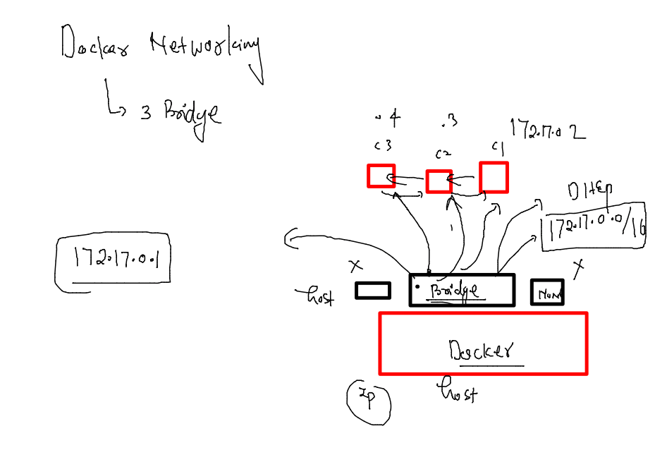

### checking docker networks 

```
 docker network  ls
NETWORK ID     NAME      DRIVER    SCOPE
fbb44ed77413   bridge    bridge    local
b5f34dc63b5b   host      host      local
a1d6e75a88ae   none      null      local
[ashu@docker-host webapp1]$ docker network   inspect  fbb44ed77413
[
    {
        "Name": "bridge",
        "Id": "fbb44ed774136aefaed2e3d339b1665f2c25c850f131d9502d9da5ad20c628c9",
        "Created": "2022-05-30T04:42:58.171461445Z",
        "Scope": "local",
        "Driver": "bridge",
        "EnableIPv6": false,
        "IPAM": {
            "Driver": "default",
            "Options": null,
            "Config": [
                {
                    "Subnet": "172.17.0.0/16"
                }
            ]
        },
        "Internal": false,

```

### checking container IP 

```
[ashu@docker-host webapp1]$ docker  inspect  ashuc1
```

### containers from same bridge can connect 

```
 docker  run -itd --name test  alpine 
[ashu@docker-host webapp1]$ docker  run -itd --name test  alpine 
632fb33174f4024130dc613ec1f1fdecac5a3a9d4a53b26ea480a13a35a2eade
[ashu@docker-host webapp1]$ 
[ashu@docker-host webapp1]$ 
[ashu@docker-host webapp1]$ docker  exec -it  test  sh 
/ # 
/ # ping  172.17.0.2 
PING 172.17.0.2 (172.17.0.2): 56 data bytes
64 bytes from 172.17.0.2: seq=0 ttl=64 time=0.112 ms
64 bytes from 172.17.0.2: seq=1 ttl=64 time=0.080 ms
^C
--- 172.17.0.2 ping statistics ---
2 packets transmitted, 2 packets received, 0% packet loss
round-trip min/avg/max = 0.080/0.096/0.112 ms
/ # ping  172.17.0.3
PING 172.17.0.3 (172.17.0.3): 56 data bytes
64 bytes from 172.17.0.3: seq=0 ttl=64 time=0.113 ms
64 bytes from 172.17.0.3: seq=1 ttl=64 time=0.086 ms
^C

```

### NAT is already configured with Host IP 

```
docker  exec -it  test  sh 
/ # 
/ # 
/ # ping  google.com 
PING google.com (172.253.122.101): 56 data bytes
64 bytes from 172.253.122.101: seq=0 ttl=49 time=1.738 ms
64 bytes from 172.253.122.101: seq=1 ttl=49 time=1.976 ms
64 bytes from 172.253.122.101: seq=2 ttl=49 time=1.829 ms
^C
--- google.com ping statistics ---
3 packets transmitted, 3 packets received, 0% packet loss
round-trip min/avg/max = 1.738/1.847/1.976 ms
/ # exit
[ashu@docker-host webapp1]$ 

```

### 

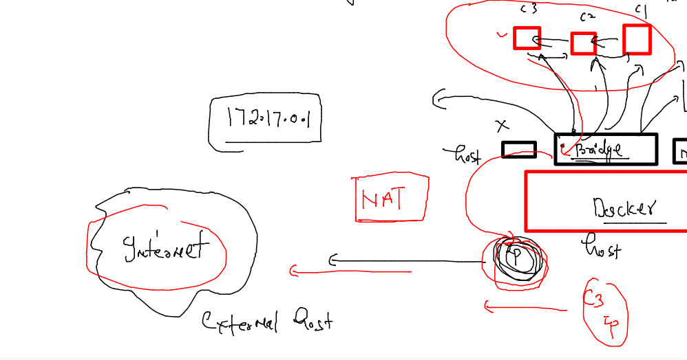

### POrt forwarding 

```
docker  run -itd --name ashuc2 -p  1144:80   ashuwebapp:v2
1b7044c472b4a2a8f263826b51fe4efdf567b4666d695551a967e1b922c30a02
[ashu@docker-host webapp1]$ docker  ps
CONTAINER ID   IMAGE              COMMAND                  CREATED          STATUS          PORTS                                   NAMES
1b7044c472b4   ashuwebapp:v2      "/docker-entrypoint.…"   2 seconds ago    Up 1 second     0.0.0.0:1144->80/tcp, :::1144->80/tcp   ashuc2
632fb33174f4   alpine             "/bin/sh"                12 minutes ago   Up 12 minutes                        

```
### Solution to no network question 

```
docker  network ls
NETWORK ID     NAME      DRIVER    SCOPE
fbb44ed77413   bridge    bridge    local
b5f34dc63b5b   host      host      local
a1d6e75a88ae   none      null      local
[ashu@docker-host webapp1]$ 
[ashu@docker-host webapp1]$ 
[ashu@docker-host webapp1]$ 
[ashu@docker-host webapp1]$ docker  run -itd  --name ashucc11 --network  none  oraclelinux:8.4  
e12cb7f85b2a013ee27d0b0c93578fb62b1e4488aa7430d919a980ba198f55b0
[ashu@docker-host webapp1]$ 
[ashu@docker-host webapp1]$ 
[ashu@docker-host webapp1]$ docker  exec -it ashucc11  bash 
[root@e12cb7f85b2a /]# ping  172.17.0.1
connect: Network is unreachable
[root@e12cb7f85b2a /]# ping  google.com 
ping: google.com: Name or service not known
[root@e12cb7f85b2a /]# exit
exit

```
### Container with Custom Bridge -- 

```
 docker  network  create  ashubr1
c9e5f68ea4c57cee65c1c983a0d914f8d603baa1e8b087475e6f862713b98b2f
[ashu@docker-host webapp1]$ docker  network  ls
NETWORK ID     NAME      DRIVER    SCOPE
c9e5f68ea4c5   ashubr1   bridge    local
fbb44ed77413   bridge    bridge    local
b5f34dc63b5b   host      host      local
a1d6e75a88ae   none      null      local
[ashu@docker-host webapp1]$ docker  network inspect  ashubr1 
[
    {
        "Name": "ashubr1",
        "Id": "c9e5f68ea4c57cee65c1c983a0d914f8d603baa1e8b087475e6f862713b98b2f",
        "Created": "2022-05-30T09:38:52.352673294Z",
        "Scope": "local",
        "Driver": "bridge",
        "EnableIPv6": false,
        "IPAM": {
            "Driver": "default",
            "Options": {},
            "Config": [
                {
                    "Subnet": "172.18.0.0/16",
                    "Gateway": "172.18.0.1"


```

### container from same bridge can connect 

```
 docker run -itd  --name ashuc1  --network ashubr1  alpine 
2e978f557e1f4b70596414552ecdc8264ebaeb5103f3568b5d4b8c3ee4e40c39
[ashu@docker-host webapp1]$ 
[ashu@docker-host webapp1]$ 
[ashu@docker-host webapp1]$ docker run -itd  --name ashuc2  --network ashubr1  alpine 
33e8a28e638a20a19b7d993d7e7635b4c0628dfacd8e46f67483c91c2a0b3398
[ashu@docker-host webapp1]$ 
[ashu@docker-host webapp1]$ 
[ashu@docker-host webapp1]$ docker run -itd  --name ashuc3  alpine 
9fd6ecdb872a8f203f696a096ba71e5bf6f1fa1079a9015055a5a556d3ab9de3
[ashu@docker-host webapp1]$ 
[ashu@docker-host webapp1]$ 
[ashu@docker-host webapp1]$ docker  exec -it ashuc1  sh 
/ # ping  ashuc2
PING ashuc2 (172.18.0.3): 56 data bytes
64 bytes from 172.18.0.3: seq=0 ttl=64 time=0.084 ms
64 bytes from 172.18.0.3: seq=1 ttl=64 time=0.090 ms
^C
--- ashuc2 ping statistics ---
2 packets transmitted, 2 packets received, 0% packet loss
round-trip min/avg/max = 0.084/0.087/0.090 ms
/ # ping  ashuc3
ping: bad address 'ashuc3'
/ # 

```

### creating custom bridge with custom subnet 

```
 docker  network  create  ashubr2  --subnet  192.168.100.0/24  --gateway 192.168.100.1 
143c45308449ac8c99279859fffc535fa6830f82f2a8e12e987a5cb2bdf5edcb
[ashu@docker-host webapp1]$ 
[ashu@docker-host webapp1]$ docker network  ls
NETWORK ID     NAME         DRIVER    SCOPE
c9e5f68ea4c5   ashubr1      bridge    local
143c45308449   ashubr2      bridge    local
fbb44ed77413   bridge       bridge    local
b5f34dc63b5b   host         host      local
e35c52c7710d   mousumibr1   bridge    local
a1d6e75a88ae   none         null      local
[ashu@docker-host webapp1]$ docker network inspect  ashubr2
[
    {
        "Name": "ashubr2",
        "Id": "143c45308449ac8c99279859fffc535fa6830f82f2a8e12e987a5cb2bdf5edcb",
        "Created": "2022-05-30T09:43:53.80204157Z",
        "Scope": "local",
        "Driver": "bridge",
        "EnableIPv6": false,
        "IPAM": {
            "Driver": "default",
            "Options": {},
            "Config": [
                {
                    "Subnet": "192.168.100.0/24",
                    "Gateway": "192.168.100.1"


```

### Demo 

```
 153  docker  network  create  ashubr2  --subnet  192.168.100.0/24  --gateway 192.168.100.1 
  154  docker network  ls
  155  docker network inspect  ashubr2
  156  history 
[ashu@docker-host webapp1]$ docker  run -idt --name ashuc4  --network  ashubr2  alpine  
3a6260655cc712f2c49f9d1cd6491d5c34666e4447de42e9e69e7d393127a786
[ashu@docker-host webapp1]$ 
[ashu@docker-host webapp1]$ 
[ashu@docker-host webapp1]$ docker  run -idt --name ashuc5 --ip 192.168.100.200   --network  ashubr2  alpine  
4d9625a8a254b2aa2cf5b73535ea2bab3c21fd4c556aceb407c76e2ae6ff9b39
[ashu@docker-host webapp1]$ 
[ashu@docker-host webapp1]$ docker  exec -it ashuc4 sh 
/ # ping ashuc5
PING ashuc5 (192.168.100.200): 56 data bytes
64 bytes from 192.168.100.200: seq=0 ttl=64 time=0.092 ms
64 bytes from 192.168.100.200: seq=1 ttl=64 time=0.092 ms
^C
--- ashuc5 ping statistics ---
2 packets transmitted, 2 packets received, 0% packet loss
round-trip min/avg/max = 0.092/0.092/0.092 ms
/ # 

```

### Docker network bridge Drivers 

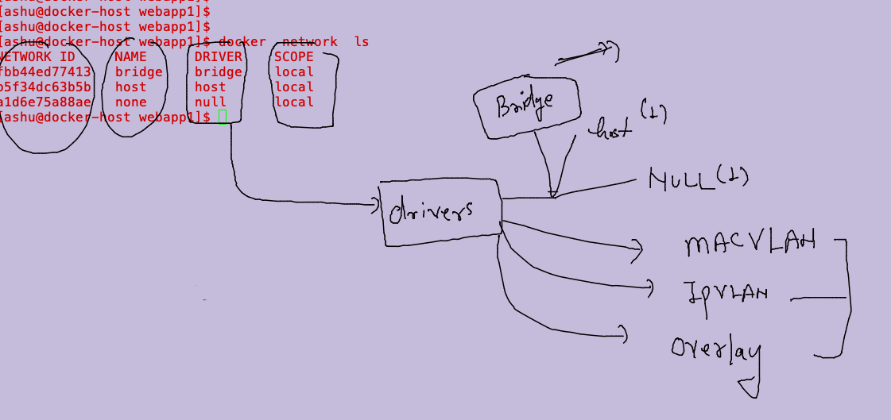

### mac vlan bridge 

```
 docker  network create  ashubr007  --subnet  192.168.1.0/24  --gateway 192.168.1.254  --driver macvlan -o parent=ens33
  docker run -itd --name c1111 --network ashubr007 --ip 192.168.1.200 alpine 
  docker run -itd --name c22 --network ashubr007 --ip 192.168.1.201 --privileged  dockerashu/ansible:centos_targetv2
```


### Docker overlay bridge 

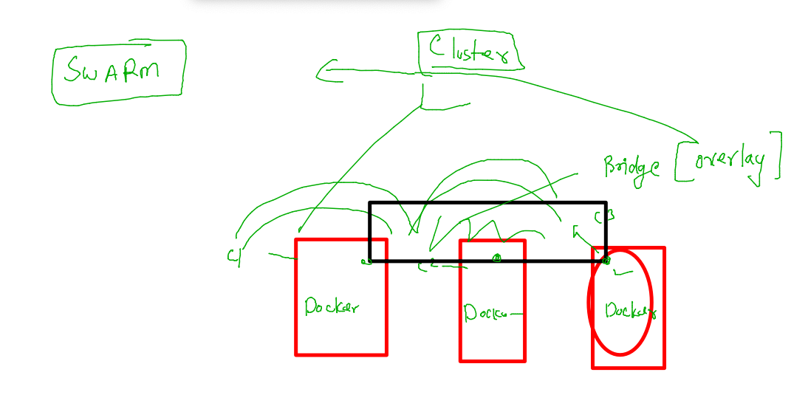


### Container restart Policy 

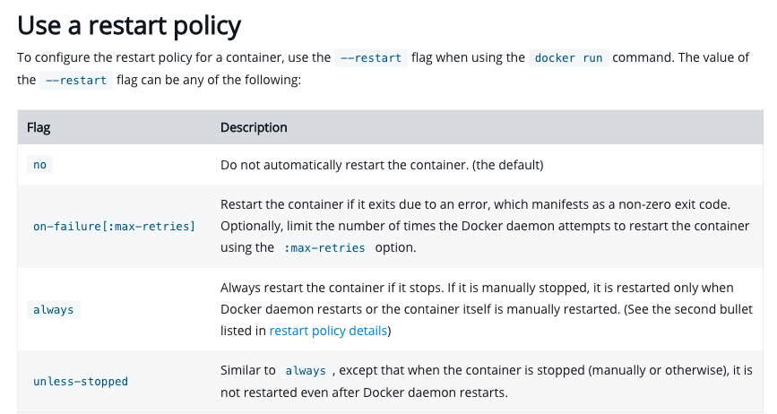

### demo 

```
 docker run -d --name c001  --restart always  nginx 
25c06030232136f05d46c4a651f5d387896fc4378f618a654e99e03fb92b57d4
[ashu@docker-host webapp1]$ docker  ps
CONTAINER ID   IMAGE     COMMAND                  CREATED         STATUS        PORTS     NAMES
25c060302321   nginx     "/docker-entrypoint.…"   2 seconds ago   Up 1 second   80/tcp    c001
[ashu@docker-host webapp1]$ docker  start ashuc1 
ashuc1
[ashu@docker-host webapp1]$ docker  ps
CONTAINER ID   IMAGE           COMMAND                  CREATED          STATUS         PORTS     NAMES
25c060302321   nginx           "/docker-entrypoint.…"   9 seconds ago    Up 9 seconds   80/tcp    c001
87d8272ba028   ashuwebapp:v2   "/docker-entrypoint.…"   49 minutes ago   Up 1 second              ashuc1
[ashu@docker-host webapp1]$ docker  ps
CONTAINER ID   IMAGE     COMMAND                  CREATED          STATUS         PORTS     NAMES
25c060302321   nginx     "/docker-entrypoint.…"   29 seconds ago   Up 5 seconds   80/tcp    c001
[ashu@docker-host webapp1]$ 


```

### Docker volume Importance 

### creating mysql Db container 

```
docker  run -d  --name ashudb1  -e MYSQL_ROOT_PASSWORD=Docker@099#  mysql
```

### creating db inside container 

```
  196  docker  run -d  --name ashudb1  -e MYSQL_ROOT_PASSWORD=Docker@099#  mysql  
  197  docker  ps
  198  docker logs   ashudb1
  199  history 
[ashu@docker-host webapp1]$ docker  ps
CONTAINER ID   IMAGE     COMMAND                  CREATED              STATUS              PORTS                 NAMES
5f74d2e40249   mysql     "docker-entrypoint.s…"   About a minute ago   Up About a minute   3306/tcp, 33060/tcp   ashudb1
[ashu@docker-host webapp1]$ 
[ashu@docker-host webapp1]$ 
[ashu@docker-host webapp1]$ docker  exec -it  ashudb1  bash 
root@5f74d2e40249:/# 
root@5f74d2e40249:/# mysql -u root -p
Enter password: 
Welcome to the MySQL monitor.  Commands end with ; or \g.
Your MySQL connection id is 8
Server version: 8.0.29 MySQL Community Server - GPL

Copyright (c) 2000, 2022, Oracle and/or its affiliates.

Oracle is a registered trademark of Oracle Corporation and/or its
affiliates. Other names may be trademarks of their respective
owners.

Type 'help;' or '\h' for help. Type '\c' to clear the current input statement.

mysql> show databases;
+--------------------+
| Database           |
+--------------------+
| information_schema |
| mysql              |
| performance_schema |
| sys                |
+--------------------+
4 rows in set (0.00 sec)

mysql> create  database oracle_data;
Query OK, 1 row affected (0.00 sec)

mysql> show databases;
+--------------------+
| Database           |
+--------------------+
| information_schema |
| mysql              |
| oracle_data        |
| performance_schema |
| sys                |
+--------------------+
5 rows in set (0.00 sec)

mysql> ^DBye

```

### MYSQL container with volume 

```
docker  run -d  --name ashudb1  -e MYSQL_ROOT_PASSWORD=Docker@099# -v  ashuvol1:/var/lib/mysql/  mysql

```


