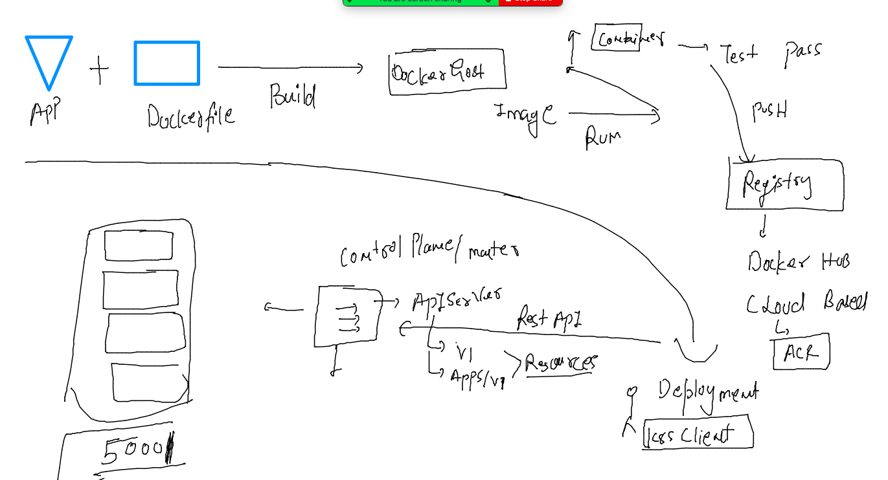
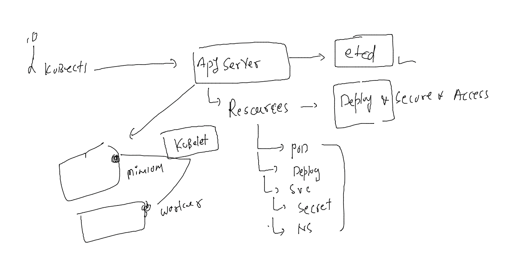
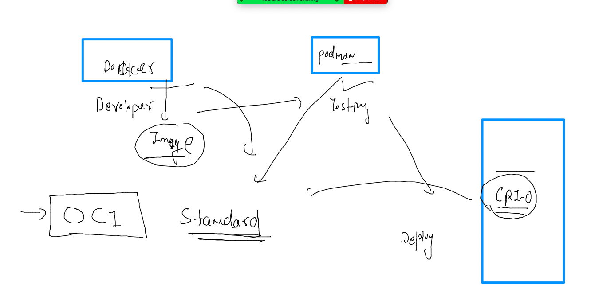
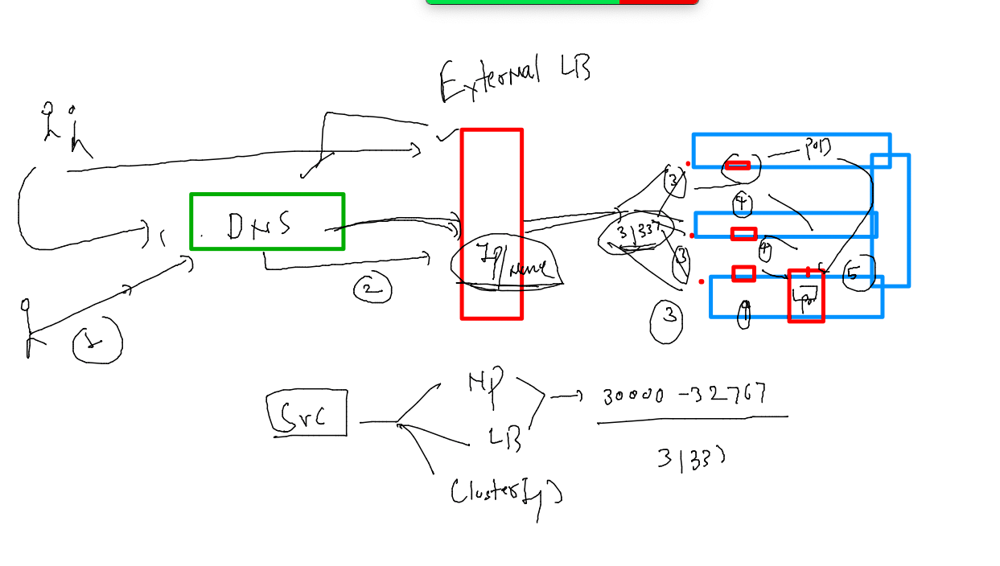
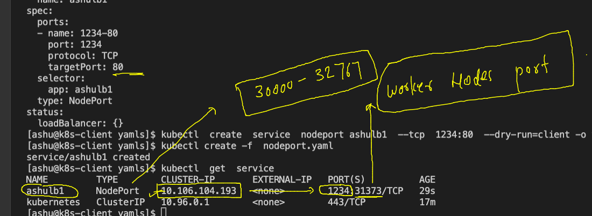
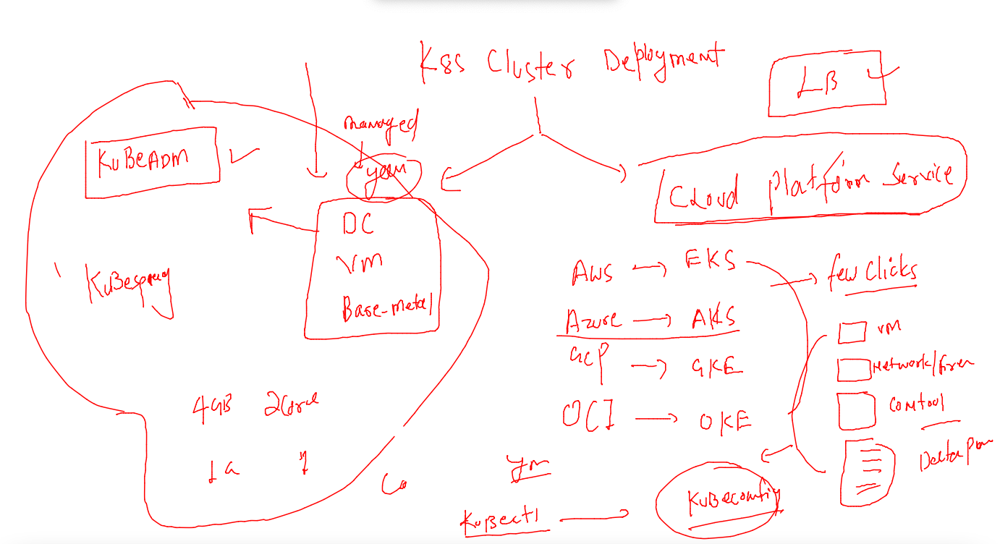
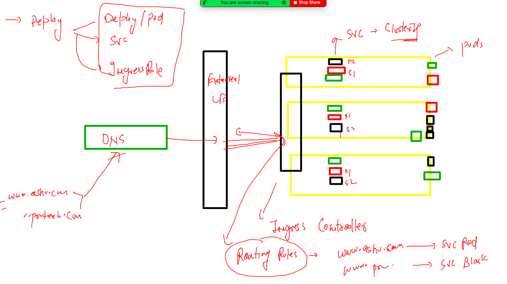
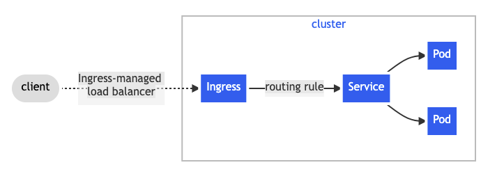
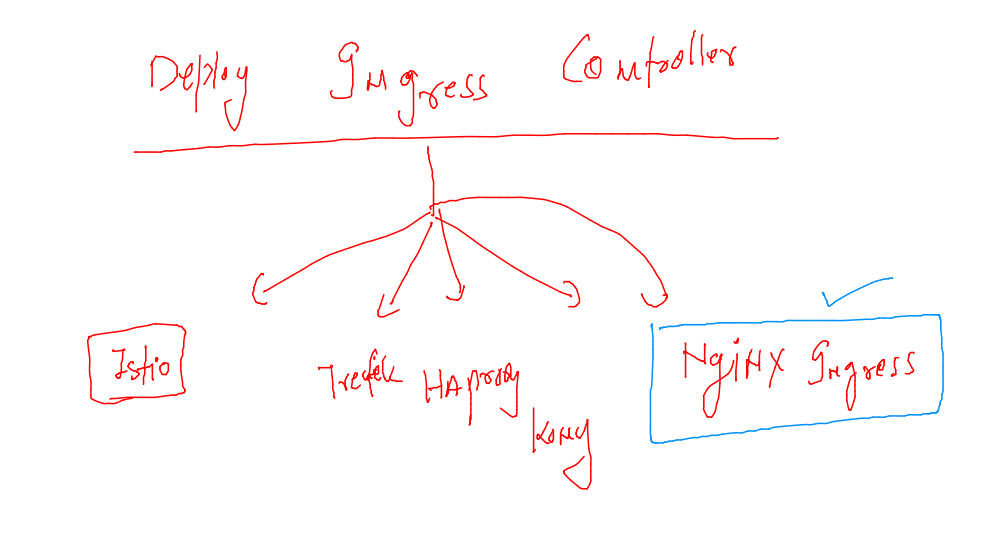
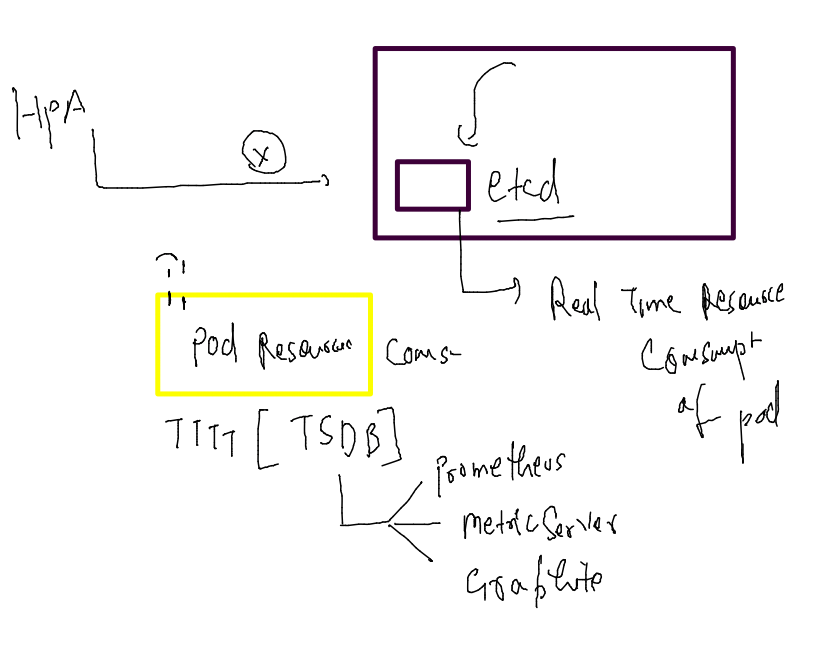

# oracle-dk-k8s-adv-30thmay2022

## plan 


### Revision 



### 



### OPen container initiative 



### checking and cleaning namespace data

```
 kubectl config get-contexts 
CURRENT   NAME                          CLUSTER      AUTHINFO           NAMESPACE
*         kubernetes-admin@kubernetes   kubernetes   kubernetes-admin   ashu-space
[ashu@k8s-client multiapp]$ kubectl delete all --all
pod "ashudb-845fb98bcc-l896d" deleted
pod "db-client-69c4f4d48c-stpxj" deleted
service "ashdb-svc" deleted
service "lb1" deleted
deployment.apps "ashudb" deleted
deployment.apps "db-client" deleted

```

### creating deployment 

```
 kubectl create deployment  ashuday4app --image=dockerashu/oracle:app007   --port 80 --dry-run=client -o yaml  >day4deploy.yaml

```

### External LB is required 



### deploy the deployment and scale it manually 

```
kubectl apply -f  day4deploy.yaml 
deployment.apps/ashuday4app created
[ashu@k8s-client yamls]$ kubectl  get deploy 
NAME          READY   UP-TO-DATE   AVAILABLE   AGE
ashuday4app   1/1     1            1           17s
[ashu@k8s-client yamls]$ kubectl  get  po 
NAME                          READY   STATUS    RESTARTS   AGE
ashuday4app-567d45f9c-lff28   1/1     Running   0          76s
[ashu@k8s-client yamls]$ kubectl  scale deploy ashuday4app  --replicas=3
deployment.apps/ashuday4app scaled
[ashu@k8s-client yamls]$ kubectl  get  po 
NAME                          READY   STATUS    RESTARTS   AGE
ashuday4app-567d45f9c-ffjpx   1/1     Running   0          3s
ashuday4app-567d45f9c-lff28   1/1     Running   0          13m
ashuday4app-567d45f9c-mt7qw   1/1     Running   0          3s
[ashu@k8s-client yamls]$ kubectl  get  po  --show-labels
NAME                          READY   STATUS    RESTARTS   AGE   LABELS
ashuday4app-567d45f9c-ffjpx   1/1     Running   0          15s   app=ashuday4app,pod-template-hash=567d45f9c
ashuday4app-567d45f9c-lff28   1/1     Running   0          13m   app=ashuday4app,pod-template-hash=567d45f9c
ashuday4app-567d45f9c-mt7qw   1/1     Running   0          15s   app=ashuday4app,pod-template-hash=567d45f9c

```

### to autmatically match the label of pods we will use expose command 

```
[ashu@k8s-client yamls]$ kubectl  get  deploy 
NAME          READY   UP-TO-DATE   AVAILABLE   AGE
ashuday4app   3/3     3            3           16m
[ashu@k8s-client yamls]$ kubectl  get  svc
No resources found in ashu-space namespace.
[ashu@k8s-client yamls]$ 
[ashu@k8s-client yamls]$ kubectl  expose deploy ashuday4app  --type NodePort --port 80 --name ashulb1 --dry-run=client -o   yaml  >day4np.yaml 
[ashu@k8s-client yamls]$ kubectl  apply -f day4np.yaml 
service/ashulb1 created
[ashu@k8s-client yamls]$ kubectl  get  svc 
NAME      TYPE       CLUSTER-IP      EXTERNAL-IP   PORT(S)        AGE
ashulb1   NodePort   10.104.39.255   <none>        80:32122/TCP   3s
[ashu@k8s-client yamls]$ kubectl  get  svc  -o wide
NAME      TYPE       CLUSTER-IP      EXTERNAL-IP   PORT(S)        AGE   SELECTOR
ashulb1   NodePort   10.104.39.255   <none>        80:32122/TCP   9s    app=ashuday4app

```

### Understanding loadbalancer using Nodeport service 



### NOdeport vs LB service type 



### laodbalancer in cloud based k8s service 

```
kubectl expose deploy prateekdep1  --type LoadBalancer --port 80 --name prateeklb1 
service/prateeklb1 exposed
fire@ashutoshhs-MacBook-Air ~ % kubectl get  svc
NAME         TYPE           CLUSTER-IP     EXTERNAL-IP     PORT(S)        AGE
ashulb1      NodePort       10.0.197.134   <none>          80:31035/TCP   7m13s
ashulb2      LoadBalancer   10.0.30.16     20.204.238.53   80:32373/TCP   6m6s
kubernetes   ClusterIP      10.0.0.1       <none>          443/TCP        19m
prateeklb1   LoadBalancer   10.0.164.162   <pending>       80:31251/TCP   3s
fire@ashutoshhs-MacBook-Air ~ % kubectl get  svc
NAME         TYPE           CLUSTER-IP     EXTERNAL-IP     PORT(S)        AGE
ashulb1      NodePort       10.0.197.134   <none>          80:31035/TCP   7m57s
ashulb2      LoadBalancer   10.0.30.16     20.204.238.53   80:32373/TCP   6m50s
kubernetes   ClusterIP      10.0.0.1       <none>          443/TCP        19m
prateeklb1   LoadBalancer   10.0.164.162   20.204.187.7    80:31251/TCP   47s

```

### Ingress controller in k8s 



### ingress go 



### ingress controller options 



### nginx ingress controller deployment 

[LInk](https://kubernetes.github.io/ingress-nginx/)

```
 kubectl apply -f https://raw.githubusercontent.com/kubernetes/ingress-nginx/controller-v1.2.0/deploy/static/provider/baremetal/deploy.yaml
namespace/ingress-nginx created
serviceaccount/ingress-nginx created
serviceaccount/ingress-nginx-admission created
role.rbac.authorization.k8s.io/ingress-nginx created
role.rbac.authorization.k8s.io/ingress-nginx-admission created
clusterrole.rbac.authorization.k8s.io/ingress-nginx created
clusterrole.rbac.authorization.k8s.io/ingress-nginx-admission created
rolebinding.rbac.authorization.k8s.io/ingress-nginx created
rolebinding.rbac.authorization.k8s.io/ingress-nginx-admission created
clusterrolebinding.rbac.authorization.k8s.io/ingress-nginx created
clusterrolebinding.rbac.authorization.k8s.io/ingress-nginx-admission created
configmap/ingress-nginx-controller created
service/ingress-nginx-controller created
service/ingress-nginx-controller-admission created
deployment.apps/ingress-nginx-controller cre

```

### verify 

```
kubectl  get  ns
NAME                   STATUS   AGE
ashu-space             Active   24h
default                Active   2d2h
ingress-nginx          Active   32s
kube-node-lease        Active   2d2h
kube-public            Active   2d2h
kube-system            Active   2d2h
kubernetes-dashboard   Active   20h
nishtha-space          Active   24h
prat-space             Active   24h
tanvi                  Active   24h
tasks                  Active   23h
[ashu@k8s-client multiapp]$ kubectl  get  deploy -n ingress-nginx
NAME                       READY   UP-TO-DATE   AVAILABLE   AGE
ingress-nginx-controller   1/1     1            1           42s
[ashu@k8s-client multiapp]$ kubectl  get  po  -n ingress-nginx
NAME                                        READY   STATUS      RESTARTS   AGE
ingress-nginx-admission-create-k5nws        0/1     Completed   0          49s
ingress-nginx-admission-patch-2b5dm         0/1     Completed   0          49s
ingress-nginx-controller-6b864cf6dd-4sqcz   1/1     Running     0          49s
[ashu@k8s-client multiapp]$ kubectl  get svc  -n ingress-nginx
NAME                                 TYPE        CLUSTER-IP       EXTERNAL-IP   PORT(S)                      AGE
ingress-nginx-controller             NodePort    10.105.225.240   <none>        80:32113/TCP,443:32663/TCP   57s
ingress-nginx-controller-admission   ClusterIP   10.104.196.225   <none>        443/TCP                      57s
[ashu@k8s-client multiapp]$ 

```
### task 

```
apiVersion: v1
kind: Namespace
metadata:
  creationTimestamp: null
  name: ashuk8s1
spec: {}
status: {}
---
apiVersion: v1
kind: Pod
metadata:
  creationTimestamp: null
  labels:
    run: ashupod1
  name: ashupod1
  namespace: ashuk8s1
spec:
  containers:
  - command:
    - sleep
    - "1000000"
    image: ubuntu
    name: ashupod1
    resources: {}
  dnsPolicy: ClusterFirst
  restartPolicy: Always
status: {}

---
apiVersion: v1
kind: Service
metadata:
  creationTimestamp: null
  labels:
    app: ashusvc1
  name: ashusvc1
  namespace: ashuk8s1
spec:
  ports:
  - name: 1234-80
    port: 1234
    protocol: TCP
    targetPort: 80
    nodePort: 32001 # choosing static node port 
  selector:
    app: ashusvc1
  type: NodePort

status:
  loadBalancer: {}

```
### Implementing ingress controller 

### webapp home page deployment 

```
kubectl create  deployment  oraclehome --image=dockerashu/oracle:home      --port 80 --dry-run=client -o yaml >oraclehome.yaml
kubectl  apply -f  oraclehome.yaml 
deployment.apps/oraclehome created
[ashu@k8s-client yamls]$ kubectl  get  deploy 
NAME         READY   UP-TO-DATE   AVAILABLE   AGE
oraclehome   1/1     1            1           6s
[ashu@k8s-client yamls]$ kubectl  get  po
NAME                          READY   STATUS    RESTARTS   AGE
oraclehome-6d794ffb5f-nvpc4   1/1     Running   0          10s
===
kubectl  scale deploy oraclehome --replicas=3
deployment.apps/oraclehome scaled
[ashu@k8s-client yamls]$ kubectl get  po 
NAME                          READY   STATUS    RESTARTS   AGE
oraclehome-6d794ffb5f-2fgdd   1/1     Running   0          9s
oraclehome-6d794ffb5f-nvpc4   1/1     Running   0          109s
oraclehome-6d794ffb5f-wmbvc   1/1     Running   0          9s

=====

```
### creating service of clusterIP type 

```
kubectl  get deploy 
NAME         READY   UP-TO-DATE   AVAILABLE   AGE
oraclehome   3/3     3            3           6m55s
[ashu@k8s-client yamls]$ kubectl  expose  deploy  oraclehome  --type ClusterIP --port 80 --name oracle-home-svc 
service/oracle-home-svc exposed
[ashu@k8s-client yamls]$ kubectl   get  svc
NAME              TYPE        CLUSTER-IP     EXTERNAL-IP   PORT(S)   AGE
oracle-home-svc   ClusterIP   10.99.160.48   <none>        80/TCP    4s
[ashu@k8s-client yamls]$ 

```

### ingress YAML for route rule 

```
apiVersion: networking.k8s.io/v1
kind: Ingress
metadata:
  name: ashu-oracle-app-rule1
  annotations:
    nginx.ingress.kubernetes.io/rewrite-target: /
spec:
  ingressClassName: nginx # class means product name 
  rules:
  - host: india.oracle.com # rule of this Domain 
    http:
      paths:
      - path: / # mean for default home page 
        pathType: Prefix
        backend:
          service:
            name: oracle-home-svc # forward traffic here 
            port:
              number: 80

```

==
###

```
 kubectl apply -f  router-rules.yaml 
ingress.networking.k8s.io/ashu-oracle-app-rule1 created
[ashu@k8s-client yamls]$ kubectl  get ingress
NAME                    CLASS   HOSTS              ADDRESS   PORTS   AGE
ashu-oracle-app-rule1   nginx   india.oracle.com             80      40s
[ashu@k8s-client yamls]$ kubectl  get ingress
NAME                    CLASS   HOSTS              ADDRESS        PORTS   AGE
ashu-oracle-app-rule1   nginx   india.oracle.com   172.31.94.94   80      51s
[ashu@k8s-client yamls]$ 

```

### HPA 

### HPA need TSDB 



### deploy metric server 

```
 kubectl apply -f https://raw.githubusercontent.com/redashu/k8s/hpa/hpa/components.yaml
serviceaccount/metrics-server created
clusterrole.rbac.authorization.k8s.io/system:aggregated-metrics-reader created
clusterrole.rbac.authorization.k8s.io/system:metrics-server created
rolebinding.rbac.authorization.k8s.io/metrics-server-auth-reader created
clusterrolebinding.rbac.authorization.k8s.io/metrics-server:system:auth-delegator created
clusterrolebinding.rbac.authorization.k8s.io/system:metrics-server created
service/metrics-server created
deployment.apps/metrics-server created
apiservice.apiregistration.k8s.io/v1beta1.metrics.k8s.io created
[ashu@k8s-client oracle-webapp]$ kubectl  get  po -n kube-system 
NAME                                       READY   STATUS    RESTARTS        AGE
calico-kube-controllers-56cdb7c587-vkd5g   1/1     Running   2 (5h57m ago)   2d5h
calico-node-2zdfp                          1/1     Running   2 (5h57m ago)   2d5h
calico-node-hwd67                          1/1     Running   2 (5h57m ago)   2d5h
calico-node-hxvml                          1/1     Running   2 (5h57m ago)   2d5h
coredns-6d4b75cb6d-gsg5q                   1/1     Running   2 (5h57m ago)   2d5h
coredns-6d4b75cb6d-mf6fq                   1/1     Running   2 (5h57m ago)   2d5h
etcd-control-plane                         1/1     Running   2 (5h57m ago)   2d5h
kube-apiserver-control-plane               1/1     Running   2 (5h57m ago)   2d5h
kube-controller-manager-control-plane      1/1     Running   2 (5h57m ago)   2d5h
kube-proxy-jlpwx                           1/1     Running   2 (5h57m ago)   2d5h
kube-proxy-mnwcc                           1/1     Running   2 (5h57m ago)   2d5h
kube-proxy-vjjgv                           1/1     Running   2 (5h57m ago)   2d5h
kube-scheduler-control-plane               1/1     Running   2 (5h57m ago)   2d5h
metrics-server-5b46bd8f77-gstqr            1/1     Running   0               12s
```

### check resources 

```
kubectl top  node
NAME            CPU(cores)   CPU%   MEMORY(bytes)   MEMORY%   
control-plane   121m         6%     924Mi           11%       
node1           245m         12%    747Mi           9%        
node2           75m          3%     696Mi           8%        
[ashu@k8s-client oracle-webapp]$ kubectl top  pods
NAME                          CPU(cores)   MEMORY(bytes)   
oraclehome-6d794ffb5f-2fgdd   0m           2Mi             
oraclehome-6d794ffb5f-nvpc4   0m           6Mi             
oraclehome-6d794ffb5f-wmbvc   0m           2Mi             
[ashu@k8s-client oracle-webapp]$ 

```

### HPA 

```
 kubectl get deploy 
NAME         READY   UP-TO-DATE   AVAILABLE   AGE
oraclehome   1/1     1            1           4m57s
[ashu@k8s-client oracle-webapp]$ 
[ashu@k8s-client oracle-webapp]$ 
[ashu@k8s-client oracle-webapp]$ kubectl  autoscale deploy  oraclehome  --cpu-percent=10 --min=3 --max=10 
horizontalpodautoscaler.autoscaling/oraclehome autoscaled
[ashu@k8s-client oracle-webapp]$ kubectl get  hpa
NAME         REFERENCE               TARGETS         MINPODS   MAXPODS   REPLICAS   AGE
oraclehome   Deployment/oraclehome   <unknown>/10%   3         10        0          5s
[ashu@k8s-client oracle-webapp]$ kubectl  get  po 
NAME                          READY   STATUS    RESTARTS   AGE
oraclehome-5d677485cf-2mvdx   1/1     Running   0          6m29s
[ashu@k8s-client oracle-webapp]$ kubectl  get  po 
NAME                          READY   STATUS    RESTARTS   AGE
oraclehome-5d677485cf-2mvdx   1/1     Running   0          6m46s
oraclehome-5d677485cf-pw84p   1/1     Running   0          15s
oraclehome-5d677485cf-vzcvg   1/1     Running   0          15s
[ashu@k8s-client oracle-webapp]$ kubectl get  hpa
NAME         REFERENCE               TARGETS   MINPODS   MAXPODS   REPLICAS   AGE
oraclehome   Deployment/oraclehome   0%/10%    3         10        3          36s
[ashu@k8s-client oracle-webapp]$ 

```

### creating Role for namespace 

```
kubectl create  role  pod-role-1  --resource=pod --verb=list,get,create -n dev-team 
role.rbac.authorization.k8s.io/pod-role-1 created
[ashu@k8s-client oracle-webapp]$ 
[ashu@k8s-client oracle-webapp]$ 
[ashu@k8s-client oracle-webapp]$ kubectl  get  roles   -n  dev-team 
NAME         CREATED AT
pod-role-1   2022-06-02T11:26:47Z

```

### binding 

```
 kubectl  get  roles   -n  dev-team 
NAME         CREATED AT
pod-role-1   2022-06-02T11:26:47Z
svc-role-1   2022-06-02T11:28:14Z
[ashu@k8s-client oracle-webapp]$ kubectl  get  sa   -n  dev-team 
NAME      SECRETS   AGE
default   0         30m
[ashu@k8s-client oracle-webapp]$ 
[ashu@k8s-client oracle-webapp]$ kubectl create rolebinding sa-bind1 --role=pod-role-1  --serviceaccount=dev-team:default -n dev-team 
rolebinding.rbac.authorization.k8s.io/sa-bind1 created
[ashu@k8s-client oracle-webapp]$ 
[ashu@k8s-client oracle-webapp]$ 
[ashu@k8s-client oracle-webapp]$ kubectl  get  rolebinding    -n  dev-team 
NAME       ROLE              AGE
sa-bind1   Role/pod-role-1   10s
[ashu@k8s-client oracle-webapp]$ 

```


