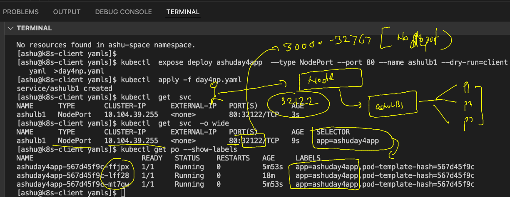

# oracle-dk-k8s-adv-30thmay2022

## plan 


### Revision 


### 


### OPen container initiative 


### checking and cleaning namespace data

```
 kubectl config get-contexts 
CURRENT   NAME                          CLUSTER      AUTHINFO           NAMESPACE
*         kubernetes-admin@kubernetes   kubernetes   kubernetes-admin   ashu-space
[ashu@k8s-client multiapp]$ kubectl delete all --all
pod "ashudb-845fb98bcc-l896d" deleted
pod "db-client-69c4f4d48c-stpxj" deleted
service "ashdb-svc" deleted
service "lb1" deleted
deployment.apps "ashudb" deleted
deployment.apps "db-client" deleted

```

### creating deployment 

```
 kubectl create deployment  ashuday4app --image=dockerashu/oracle:app007   --port 80 --dry-run=client -o yaml  >day4deploy.yaml

```

### External LB is required 


### deploy the deployment and scale it manually 

```
kubectl apply -f  day4deploy.yaml 
deployment.apps/ashuday4app created
[ashu@k8s-client yamls]$ kubectl  get deploy 
NAME          READY   UP-TO-DATE   AVAILABLE   AGE
ashuday4app   1/1     1            1           17s
[ashu@k8s-client yamls]$ kubectl  get  po 
NAME                          READY   STATUS    RESTARTS   AGE
ashuday4app-567d45f9c-lff28   1/1     Running   0          76s
[ashu@k8s-client yamls]$ kubectl  scale deploy ashuday4app  --replicas=3
deployment.apps/ashuday4app scaled
[ashu@k8s-client yamls]$ kubectl  get  po 
NAME                          READY   STATUS    RESTARTS   AGE
ashuday4app-567d45f9c-ffjpx   1/1     Running   0          3s
ashuday4app-567d45f9c-lff28   1/1     Running   0          13m
ashuday4app-567d45f9c-mt7qw   1/1     Running   0          3s
[ashu@k8s-client yamls]$ kubectl  get  po  --show-labels
NAME                          READY   STATUS    RESTARTS   AGE   LABELS
ashuday4app-567d45f9c-ffjpx   1/1     Running   0          15s   app=ashuday4app,pod-template-hash=567d45f9c
ashuday4app-567d45f9c-lff28   1/1     Running   0          13m   app=ashuday4app,pod-template-hash=567d45f9c
ashuday4app-567d45f9c-mt7qw   1/1     Running   0          15s   app=ashuday4app,pod-template-hash=567d45f9c

```

### to autmatically match the label of pods we will use expose command 

```
[ashu@k8s-client yamls]$ kubectl  get  deploy 
NAME          READY   UP-TO-DATE   AVAILABLE   AGE
ashuday4app   3/3     3            3           16m
[ashu@k8s-client yamls]$ kubectl  get  svc
No resources found in ashu-space namespace.
[ashu@k8s-client yamls]$ 
[ashu@k8s-client yamls]$ kubectl  expose deploy ashuday4app  --type NodePort --port 80 --name ashulb1 --dry-run=client -o   yaml  >day4np.yaml 
[ashu@k8s-client yamls]$ kubectl  apply -f day4np.yaml 
service/ashulb1 created
[ashu@k8s-client yamls]$ kubectl  get  svc 
NAME      TYPE       CLUSTER-IP      EXTERNAL-IP   PORT(S)        AGE
ashulb1   NodePort   10.104.39.255   <none>        80:32122/TCP   3s
[ashu@k8s-client yamls]$ kubectl  get  svc  -o wide
NAME      TYPE       CLUSTER-IP      EXTERNAL-IP   PORT(S)        AGE   SELECTOR
ashulb1   NodePort   10.104.39.255   <none>        80:32122/TCP   9s    app=ashuday4app

```

### Understanding loadbalancer using Nodeport service 



### NOdeport vs LB service type 


### laodbalancer in cloud based k8s service 

```
kubectl expose deploy prateekdep1  --type LoadBalancer --port 80 --name prateeklb1 
service/prateeklb1 exposed
fire@ashutoshhs-MacBook-Air ~ % kubectl get  svc
NAME         TYPE           CLUSTER-IP     EXTERNAL-IP     PORT(S)        AGE
ashulb1      NodePort       10.0.197.134   <none>          80:31035/TCP   7m13s
ashulb2      LoadBalancer   10.0.30.16     20.204.238.53   80:32373/TCP   6m6s
kubernetes   ClusterIP      10.0.0.1       <none>          443/TCP        19m
prateeklb1   LoadBalancer   10.0.164.162   <pending>       80:31251/TCP   3s
fire@ashutoshhs-MacBook-Air ~ % kubectl get  svc
NAME         TYPE           CLUSTER-IP     EXTERNAL-IP     PORT(S)        AGE
ashulb1      NodePort       10.0.197.134   <none>          80:31035/TCP   7m57s
ashulb2      LoadBalancer   10.0.30.16     20.204.238.53   80:32373/TCP   6m50s
kubernetes   ClusterIP      10.0.0.1       <none>          443/TCP        19m
prateeklb1   LoadBalancer   10.0.164.162   20.204.187.7    80:31251/TCP   47s

```


